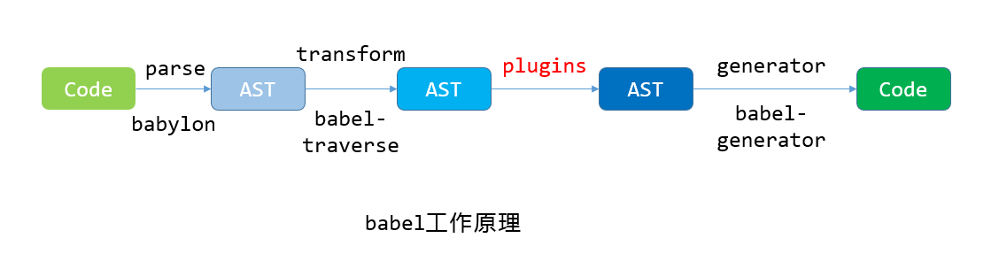

## 1 作用域

#### 1 块级作用域

```JavaScript
// let和const属于块级作用域
// 用let和const声明的变量不存在变量提升，需要先声明，后使用
// let可以只声明
// const必须声明和初始化，且不允许重复定义和赋值

let a = 'Hello'
// let a = 'World' // 同一作用域中不能使用let重复定义已经使用let声明的标识符
// var a = 'World' // 同一作用域中不能使用var重复定义已经使用let声明的标识符

var b = 'world'
console.log(b)
console.log(window.b) // 也可以通过window对象访问
// let b = 'Bye' // 同一作用域中不能使用let重复定义已经使用var声明的标识符

{
  let blockA = '666'
  const blockB = '888'
}
// console.log(blockA) // 花括号外无法访问到blockA变量
// console.log(blockB) // 花括号外无法访问到blockB变量
```

#### 2 全局作用域

```JavaScript
var c = 123 // 全局变量，不能被删除
console.log(delete c) // delete c的返回结果为false
console.log(delete window.c) // delete window.c的返回结果为false
d = 456 // 作为全局对象window的属性，可以被删除，即delete d(= delete window.d)的结果为true
console.log(delete d) // true
console.log(delete window.d) // true

function sayHi() {
  e = 'Hi' // 等价于window.e
}
sayHi()
console.log(e)
console.log(window.e)
```

#### 3 函数作用域

```JavaScript
function test() {
  var f = 'Bye world'
  console.log(f) // 变量f属于函数作用域
}
test() // 使用闭包或return语句返回函数作用域内的变量
```

#### 4 动态作用域 this

```JavaScript
window.propA = 50
function thisFunc() {
  // 'use strict'
  // 严格模式下，this指向异常
  // 非严格模式，this默认指向window
  console.log(this.propA)
}
thisFunc() // 50
thisFunc.bind({ propA: 100 })() // 100
thisFunc.call({ propA: 200 }) // 200
thisFunc.apply({ propA: 300 }) // 300

// const定义变量时必须初始化
// const variavleA // 缺少初始化，报错

// console.log(temp)
// Cannot access 'temp' before initialization
// 存在临时性死区
// let temp = 1
```

## 2 数组遍历

```JavaScript
console.log('普通遍历')
let arr = [1, 2, 3, 4, 5, 6]
for (let i = 0; i < arr.length; i++) {
  // 支持break和continue
  console.log(arr[i])
}

console.log(' forEach --------')
arr.forEach(function (value, index, arr) {
  // 不支持break和continue
  // if (value === 2) {
  //   continue
  // }
  console.log(index, value, arr)
})

console.log(' every --------')
arr.every(function (value, index, arr) {
  if (value === 2) {
    // break // 不支持break和continue
  } else {
    console.log(value)
  }
  // 只有返回值为true时，才会依次遍历
  return true
})

console.log(' for...in --------')
// for ... in 会把数组中非数字索引(所有key)遍历出来
arr.a = 8
for (let index in arr) {
  // 专为普通对象设计
  // 支持break和continue
  console.log(index, '--', arr[index])
}

console.log(' for...of --------')
for (const value of arr) {
  // 用于可迭代的对象
  // 支持break和continue
  console.log(value)
}

console.log(' 案例：遍历普通对象 --------')
const Price = {
  A: [1.5, 2.3, 4.5],
  B: [3, 4, 5],
  C: [0.5, 0.8, 1.2]
}
for (const key in Price) {
  console.log(key, Price[key][0])
}
```

## 3 伪数组

```JavaScript
// 
// 

// 1. Array.prototype.slice.call()
function func1() {
  let args = [].slice.call(arguments) // collection
  console.log(arguments)
  console.log(args)
}
func1(1, 2, 3)

let imgs = Array.prototype.slice.call(document.querySelectorAll('img')) // NodeList
console.log(imgs)

// 2. Array.from()
console.log('Array.from()')
function func2() {
  let args = Array.from(arguments) // collection
  console.log(args)
}
func2(1, 2, 3)

let imgs2 = Array.from(document.querySelectorAll('img')) // NodeList
console.log(imgs2)
imgs2.forEach(value => console.log(value))

// 3. Array.from(arrayLike, ?mapFn, ?thisArg)
let arr2 = Array(5)
for (let i = 0; i < arr2.length; i++) {
  arr2[i] = 1
}
console.log('arr2', arr2)

let arr3 = Array.from({ length: 5 }, function () {
  return 1
})
console.log(arr3)

// 伪数组：1. 按索引方式存储数据； 2. 具备length属性
console.log(Array.from({ 0: 'a', 1: 'b' })) // 返回是[]
```

## 4 创建新数组

```JavaScript
// 1 构造函数，仅接收一个参数时，为size
let arr1 = Array(5)
console.log(arr1)

// 2 数组字面量
let arr2 = [1, 2, 3, 4, 5]

// 3 Array.of
let arr3 = Array.of(1, 2, 3, 4, 5)
console.log(arr3)

// 4 Array.prototype.fill(value, ?startIndex, ?endIndex)
let arr4 = Array(5).fill(0)
console.log(arr4)
```

## 5 数组中查找元素

```JavaScript
// 遍历 转换 生成 查找

let arr = [1, 2, 3, 4, 3]
// filter关注所有元素，把满足条件的元素全部返回
let findResult = arr.filter(item => item === 3)
console.log(findResult) // [3, 3]

// Array.prototype.find 验证有还是没有
// 只要找到，就将该值返回
let result = arr.find(function (item) {
  return item % 2 === 0
})
console.log(result)

// Array.prototype.findIndex 验证有还是没有
// 只要找到，就将该值的索引返回
let index = arr.findIndex(function (item) {
  return item % 2 === 0
})
console.log(index)
```

## 6 Class 基础语法

```JavaScript
// 声明 属性 方法 继承

// ES5
let Animal = function (type, age) {
  this.type = type
  this.age = age
}

Animal.prototype.eat = function () {
  console.log('I am eating')
}

let dog = new Animal('dog', 6)
console.log(dog)
let monkey = new Animal('monkey', 5)
console.log(monkey, monkey.constructor)
// monkey.constructor === Animal // true

// ES6
class Person {
  name
  age
  constructor(name, age) {
    this.name = name
    this.age = age
  }
  speak() {
    console.log('I am speaking.')
  }
}
let p = new Person('Tom', 18)
console.log(p, p.constructor)
p.speak()
console.log(p instanceof Person) // true
console.log(typeof Person) // function
```

## 7 getter 和 setter

```JavaScript
class Aminal {
  type
  #realAge // 私有属性
  constructor(type, realAge) {
    this.type = type
    this.#realAge = realAge
  }
  get age() {
    // age是暴露给实例对象操作的出入口
    // 通过属性的形式访问和修改
    return this.#realAge
  }
  set age(val) {
    this.#realAge = val
  }
  eat() {
    console.log('I am eating')
  }
}
let dog = new Aminal('dog', 4)
console.log(dog)
console.log(dog.age) // 4
dog.age = 5
console.log(dog.age) // 5

// Uncaught SyntaxError:
// Private field '#realAge' must be declared
// in an enclosing class
// console.log(dog.#realAge)
```

## 8 静态方法

```JavaScript
// ES5 静态方法
let Animal = function (type) {
  this.type = type
}
// 添加类的静态方法
Animal.walk = function () {
  console.log('I am walking')
}
Animal.prototype.eat = function () {
  Animal.walk()
  console.log('I am eating.')
}
let dog = new Animal('dog')
dog.eat()
console.log(dog)
Animal.walk()

// ES6 静态方法
class Animal {
  type
  constructor(type) {
    this.type = type
  }
  eat() {
    Animal.walk() // 调用类的静态方法
    console.log('I am eating.')
  }
  // 添加类的静态方法，使用static关键字
  static walk() {
    console.log('I am walking')
  }
}

let dog = new Animal('dog')
dog.eat()
Animal.walk()
```

## 9 继承

```JavaScript
// ES5 继承
let Animal = function (type) {
  this.type = type
}
// 添加类的静态方法
Animal.walk = function () {
  console.log('I am walking')
}
// 实例方法
Animal.prototype.eat = function () {
  Animal.walk()
  console.log('I am eating.')
}

// ES5 类的继承
let Dog = function () {
  // 初始化父类的构造函数，父类的属性挂载到当前的对象上
  Animal.call(this, 'dog')
  this.run = function () {
    console.log('I can run')
  }
}
// 改变原型链指向
Dog.prototype = Animal.prototype
Dog.prototype.bark = function () {
  console.log('The small dog is barking')
}

let newDog = new Dog()
console.log(newDog)
newDog.eat()
newDog.bark()

let monkey = new Animal('monkey')
monkey.bark()

// ES6 继承
class Animal {
  type
  constructor(type) {
    this.type = type
  }
  eat() {
    Animal.walk()
    console.log('I am eating')
  }
  static walk() {
    console.log('I am walking')
  }
}

class Dog extends Animal {
  age
  constructor(type) {
    super(type)
    this.age = 2
  }
  bark() {
    console.log('The dog is barking')
  }
}
let dog = new Dog('dog')
console.log(dog)
```

## 10 默认参数

```JavaScript
function func(x, y, z) {
  y = y || 7
  z = z || 42
  return x + y + z
}
console.log(func(1)) // 50
console.log(func(1, 8, 43)) // 52

function func2(x = 2, y, z = x + y) {
  console.log(Array.from(arguments))

  // 可以获取到函数定义时，没有默认值的参数的个数
  console.log('func2.length', func2.length) // 0
  return x + y + z
}
console.log(func2(1, 2, 3))

function func3(x, y, z) {
  return x + y + z
}
console.log(func3.length) // 3

function func4(x = 1, y, z) {
  return x + y + z
}
console.log(func4.length) // 0
```

## 11 剩余参数

```JavaScript
function sum1() {
  let num = 0
  // Array.prototype.forEach.call(arguments, function (item) {
  //   num += +item
  // })
  Array.from(arguments).forEach(function (item) {
    num += item
  })
  return num
}
console.log(sum1(1, 2, 3, 4))

function sum2(base, ...nums) {
  let num = 0
  nums.forEach(function (item) {
    num += +item
  })
  return base * 2 + num
}
console.log(sum2(1, 2, 3, 4))
```

## 12 展开运算符

```JavaScript
// 传入的数据是确定的，且为数组
let arr = [3, 4, 5]
function sum(x, y, z) {
  return x + y + z
}
// console.log(sum(arr[0], arr[1], arr[2]))
// console.log(sum.apply(null, arr))
console.log(sum(...arr))
```

## 13 箭头函数

```JavaScript
let sayHello = (name, city) => {
  console.log('Hello world!')
  console.log(name, city)
}
sayHello('China', 'Beijing')

// eval会将最外层的对象指向{}
/* 箭头函数中没有this绑定，必须通过查找作用域链来决定其值。
 ** 如果箭头函数被非箭头函数包含，则this绑定的是最近一层非箭头函数的this
 ** 否则，this的值会被设置为全局对象
 **/
let test = {
  color: 'red',
  say() {
    return () => {
      console.log(this.color) // 最近一层的非箭头函数为say
      console.log(this)
    }
  },
  speak: () => {
    console.log(this.color)
    console.log(this) // window
  }
}
test.say()()
test.speak()
```

## 14 对象属性

```JavaScript
// 1 对象字面量
let obj = {
  x: 1,
  y: 2
}

let x = 1
let y = 2
// ES5写法
let obj2 = {
  x: x,
  y: y
}
// ES6写法
let obj3 = {
  x,
  y
}
console.log(obj3)

console.log('------')
// 2 计算属性
let z = 3
// ES5写法
obj2[z] = 5
console.log(obj2)
// ES6写法
let obj4 = {
  x,
  y,
  [z]: 6
}
console.log(obj4)

// 3 函数
// ES5写法
let obj5 = {
  hello: function () {
    console.log('Hello')
  }
}
// ES6写法
let obj6 = {
  hello() {
    console.log('Hello world')
  }
}
obj6.hello()

// 4 ES6 生成器函数
let obj7 = {
  *hello() {
    console.log('生成器')
    yield '生成器'
  }
}
let g = obj7.hello() // 生成器
console.log(g.next()) // {value: "生成器", done: false}
```

## 15 Set 数据结构

```JavaScript
// let s = new Set()
// Set接收一个可遍历对象
let s = new Set([1, 2, 3, 4, 1, 2, 3, 4])
console.log(s) // Set中的元素不重复
// Set(4) {1, 2, 3, 4}

// 1 添加数据
s.add('Hello')
s.add('Hello')
s.add('Good bye')
s.add('Hello').add('Good bye') // 链式调用
console.log(s) // Set(6) {1, 2, 3, 4, "Hello", 'Good bye'}

// 2 删除数据
s.delete('Hello')
console.log(s) // Set(5) {1, 2, 3, 4, "Good bye"}

// 3 查找数据
console.log(s.has(1), s.size) // true 5

// 4 读取数据
console.log('keys', s.keys()) // SetIterator {1, 2, 3, 4, "Good bye"}
console.log('values', s.values()) // SetIterator {1, 2, 3, 4, "Good bye"}
console.log('entries', s.entries())
// SetIterator {1 => 1, 2 => 2, 3 => 3, 4 => 4, "Good bye" => "Good bye"}

s.forEach(function (item, key) {
  console.log(item, key)
})
for (const item of s) {
  console.log(item)
}

// 3 清空数据
s.clear()
console.log(s)
```

## 16 Map 数据结构

```JavaScript
// Map 中的key可以是任意值
// Set 中的value可以是任意值
let map = new Map([
  [1, 2],
  [3, 4]
])
// 1 查看数据条目
console.log(map.size) // 2

// 2 添加数据
map.set('h', 'h')
console.log(map) // Map(3) {1 => 2, 3 => 4, "h" => "h"}

// 3 修改数据
map.set(1, 3)
console.log(map) // Map(3) {1 => 3, 3 => 4, "h" => "h"}

// 4 删除数据
map.delete('h')
console.log(map) // Map(2) {1 => 3, 3 => 4}

// 5 查找数据，基于索引
console.log(map.has(1)) // true

// 6 根据key进行取值
console.log(map.get(1)) // 3
console.log(map.keys()) // MapIterator {1, 3}
console.log(map.values()) // MapIterator {3, 4}
console.log(map.entries()) // MapIterator {1 => 3, 3 => 4}

// 7 遍历
map.forEach((value, key) => {
  console.log(value, key)
})
for (const [key, value] of map) {
  console.log(key, value)
}

let o = function () {
  console.log('o')
}
map.set(o, 4)
console.log(map) // Map(3) {1 => 3, 3 => 4, ƒ => 4}
console.log(map.get(o)) // 4
// Map性能略高于Object

// 5 清空数据
map.clear()
console.log(map) // Map(0) {}
```

## 17 对象拷贝

Set 和 WeakSet
Map 和 WeakMap
**WeakMap 只接收对象类型的 key**

```JavaScript
const target = {
  a: {
    b: {
      c: {
        d: 4
      }
    },
    e: 5,
    f: 6,
    g: 10
  },
  h: 666
}
const source = {
  a: {
    b: {
      c: {
        d: 1
      }
    },
    e: 2,
    f: 3
  }
}
// 属于浅拷贝，会导致数据丢失
Object.assign(target, source)
console.log(target) // target.a.g属性已经丢失

const t1 = {}
const s1 = null
Object.assign(t1, s1)
console.log(t1) // {}

const t2 = {}
const s2 = undefined
Object.assign(t2, s2)
console.log(t2) // {}
```

## 18 正则 y 修饰符

```JavaScript
const str = 'aaa_aa_aaaaa'
const re1 = /a+/g
const re2 = /a+/y // sticky 连续匹配

console.log(re1.exec(str))
// ["aaa", index: 0, input: "aaa_aa_aaaaa", groups: undefined]
console.log(re2.exec(str))
// ["aaa", index: 0, input: "aaa_aa_aaaaa", groups: undefined]

console.log(re1.exec(str))
// ["aa", index: 4, input: "aaa_aa_aaaaa", groups: undefined]
console.log(re2.exec(str))
// null

console.log(re1.exec(str))
// ["aaaaa", index: 7, input: "aaa_aa_aaaaa", groups: undefined]
console.log(re2.exec(str))
// ["aaa", index: 0, input: "aaa_aa_aaaaa", groups: undefined]
```

## 19 正则 u 修饰符

```JavaScript
// 处理中文 4字节数问题:通通加u修饰符
// unicode编码
let s = '𠮷'
console.log(s.length) // 2
let s2 = '\uD842\uDFB7'
console.log(s) // 𠮷
console.log(s2) // 𠮷
console.log(/^\uD842/.test(s2)) // true 但是这样匹配的结果不应该是true
console.log(/^\uD842/u.test(s2)) // false 这才是正确结果
console.log(s === s2) // true
// 正则表达式/^.$/匹配所有单字符字符串
console.log(/^.$/.test(s)) // ES5 false
console.log(/^.$/u.test(s)) // ES6 true

// 使用Unicode码点来匹配字符，必须使用u修饰符
console.log(/\u{20BB7}/u.test(s)) // true
console.log(/\u{61}/u.test('a')) // true
console.log('--------')
console.log(/𠮷{2}/u.test('𠮷𠮷'))

console.log(/[a-z]/iu.test('\u212A')) // true
```

## 20 Template 模版语法

```JavaScript
const a = 20
const b = 10
const c = 'javascript'

const str1 = 'my age is ' + (a + b) + '. I love ' + c + '.'
const str2 = `my age is ${a + b}. I love ${c}.`
console.log(str1)
console.log(str2)

const type = 'retail'
function func(type) {
  const retailPrice = 20
  const wholeSalePrice = 16
  let showTxt = ''

  if (type === 'retail') {
    showTxt = '您此次的购买单价是:' + retailPrice
  } else {
    showTxt = '您此次的购买批发价是' + wholeSalePrice
  }
  return showTxt
}
console.log(func(type))

// 1 定义一个函数
function Price(allStrings, type) {
  let s1 = allStrings[0]
  console.log(allStrings) // ["您此次的", "", raw: Array(2)]
  console.log(type) // wholeSale
  const retailPrice = 20
  const wholeSalePrice = 16
  let showTxt = ''
  if (type === 'retail') {
    showTxt = '购买单价是：' + retailPrice
  } else {
    showTxt = '购买批发价是：' + wholeSalePrice
  }
  return `${s1}${showTxt}`
}
// 2 调用模版函数
let showTxt = Price`您此次的${'wholeSale'}`
console.log(showTxt)

// 字符串换行
let str = `我是第一行
我是第二行`
console.log(str)
```

## 21 数组解构

```JavaScript
let arr1 = ['hello', 'world']
let first1 = arr1[0] // 利用索引取值
let second1 = arr1[1] // 利用索引取值
let [first2, second2] = arr1 // 数组解构
console.log(first1, second1)
console.log(first2, second2)

let arr2 = ['a', 'b', 'c', 'd']
let [first3, , third3] = arr2
console.log(first3, third3) // a c

let s = 'abcd'
let [first4, , third4] = s
console.log(first4, third4) // a c

let [first5, , third5] = new Set([100, 200, 300, 400])
console.log(first5, third5) // 100 300

let user = {
  name: 'Allen',
  age: 18
}
for (let [key, value] of Object.entries(user)) {
  console.log(key, value)
}

let arr3 = [1, 2, 3, 4, 5, 6, 7, 8, 9]
let [first6, second6, ...last] = arr3
console.log(first6, second6, last)
// 1 2 [3, 4, 5, 6, 7, 8, 9]
```

## 22 对象解构

```JavaScript
let options1 = {
  title: 'menu',
  width: 100,
  height: 200
}
// 1 属性名重命名； 2 设置默认值无效
let { title: newTitle, width = 160, height } = options1
console.log(newTitle, width, height)
// menu 100 200

let options2 = {
  title: 'menu',
  width: 100,
  height: 200
}
// 剩余数据
let { title, ...last } = options2
console.log(title, last)

let options = {
  size: {
    width3: 100,
    height3: 200
  },
  items: ['Cake', 'Donut'],
  extra: true
}
let {
  size: { width3, height3 },
  items: [item1]
} = options
console.log(width3, height3, item1)
```

## 23 回调函数与 Promise

```JavaScript
function loadScript(src) {
  let scriptElement = document.createElement('script')
  scriptElement.src = src
  document.head.append(scriptElement)
}

function test() {
  console.log('test')
}

loadScript('./1.js')
test() // 先执行test函数 再执行1.js内的代码(事件循环)
// // 输出： test 1

// 多个回调嵌套时
function loadScript2(src, cb) {
  let scriptElement = document.createElement('script')
  scriptElement.src = src
  document.head.append(scriptElement) // 宏任务1
  // 宏任务2 打印脚本名称
  scriptElement.onload = () => {
    cb(src)
  }
  scriptElement.onerror = err => {
    cb(err)
  }
}
// 回调地狱
loadScript2('./1.js', function (script) {
  if (script.type === 'error') {
    // 监控上报逻辑
    console.log(script.type)
  } else {
    console.log(script)
    loadScript2('./2.js', function (script) {
      console.log(script)
      loadScript2('./3.js', function (script) {
        console.log(script)
      })
    })
  }
})

// Promise
function loadScript3(src) {
  // 1 返回的Promise，没有调用then方法时执行了什么
  // 2 Promise的状态是如何被改变的：通过resolve或reject来改变状态，状态不可逆
  // 3 Promise的结果是如何传递数据的
  // 关注state: pending和result: undefined
  return new Promise((resolve, reject) => {
    let script = document.createElement('script')
    script.src = src
    script.onload = () => {
      resolve(src) // fulfilled, result
    }
    script.onerror = () => {
      reject(src) // rejected, error
    }
    document.head.append(script)
  })
}
// 不规范的使用方式
loadScript3('./1.js')
  .then(loadScript3('./2.js')) // loadScript("./2.js")会作为表达式进行计算
  .then(loadScript3('./3.js'))
// 正确方式如下
loadScript3('./1.js')
  .then(
    content => {
      console.log(content)
      return loadScript3('./2.js') // 必须手动添加return
    },
    err => {
      console.log(err)
    }
  )
  .then(
    content => {
      console.log(content)
      return loadScript3('./3.js')
    },
    err => {
      console.log(err)
    }
  )
  .then(
    content => {
      console.log(content)
    },
    err => {
      console.log(err)
    }
  )

// Promise.prototype.then
// .then(onFulFilled, onRejected) 这两个参数都是函数类型，与resolve和reject息息相关
// 如果这个参数为非函数或者onFulFilled和onRejected没有写入
// .then会返回一个新的空的Promise实例

// resolve和reject
function test(bool) {
  if (bool) {
    return new Promise((resolve, reject) => {
      resolve(30)
    })
  } else {
    return Promise.reject('error') // Promise.reject()静态方法
  }
}
test(false).then(
  value => {
    console.log(value)
  },
  err => {
    console.log(err)
  }
)

// Promise.prototype.catch() 异常捕获
function loadScript4(src) {
  return new Promise((resolve, reject) => {
    let script = document.createElement('script')
    script.src = src
    script.onload = () => {
      resolve(src) // fulfilled, result
    }
    script.onerror = () => {
      reject(src) // rejected, error
    }
    document.head.append(script)
  })
}
loadScript4('./1.js')
  .then(() => {
    return loadScript4('./2.js') // 必须手动添加return
  })
  .then(() => {
    return loadScript4('./3.js')
  })
  .catch(err => {
    console.log(err)
  })

// Promise.all()
const p1 = new Promise((resolve, reject) => {
  setTimeout(function () {
    resolve(1)
  }, 1000)
})
const p2 = new Promise((resolve, reject) => {
  setTimeout(function () {
    resolve(2)
  }, 500)
})
const p3 = new Promise((resolve, reject) => {
  setTimeout(function () {
    resolve(3)
  }, 1500)
})
Promise.all([p1, p2, p3]).then(value => {
  console.log(value)
})

// Promise.race()
Promise.race([p1, p2, p3]).then(function (value) {
  console.log(value)
})
```

## 24 Reflect

```JavaScript
// 1. Reflect.apply(function, thisArg, Arr)
// 不存在Reflect.call()
// Java 的反射机制是在编译阶段不知道是哪个类被加载，而是在运行的时候才加载、执行
console.log(Math.floor.apply(null, [3.72])) // 3
console.log(Reflect.apply(Math.ceil, null, [3.72])) // 4
// Math.ceil
let price = 91.5
if (price > 100) {
  price1 = Math.floor.apply(null, [price])
} else {
  price1 = Math.ceil.apply(null, [price])
}
price2 = Reflect.apply(price > 100 ? Math.floor : Math.ceil, null, [
  price
])
console.log(price1)
console.log(price2)

// 2. Reflect.construct()
let d1 = new Date()
console.log(d1.getTime())
let d2 = Reflect.construct(Date, [])
console.log(d2.getTime())
console.log(d1 instanceof Date) // true
console.log(d2 instanceof Date) // true

// 3. Reflect.defineProperty()
let obj = {}
let result1 = Reflect.defineProperty(obj, 'name', {
  value: 'Mike'
}) // 返回true
console.log(result1) // true
let result2 = Object.defineProperty(obj, 'age', {
  value: 18
}) // 返回目标对象
console.log(result2) // {name: "Mike", age: 18}
console.log(obj)

// 4. Reflect.deleteProperty()
const obj2 = { x: 1, y: 2 }
let result3 = Reflect.deleteProperty(obj2, 'x')
console.log(result3) // 不论是否成功删除，均返回true
console.log(obj2) // {y: 2}

// 5. Reflect.get()
console.log(Reflect.get(obj2, 'y')) // 2 对象根据key取值
console.log(Reflect.get([3, 4, 5, 6, 7], 3)) // 6 数组根据索引取值

// 6. Reflect.getOwnPropertyDescriptor()
console.log(Reflect.getOwnPropertyDescriptor(obj2, 'y'))
// {value: 2, writable: true, enumerable: true, configurable: true}
console.log(Object.getOwnPropertyDescriptor(obj2, 'y'))
// {value: 2, writable: true, enumerable: true, configurable: true}

// 7. Reflect.getPrototypeOf()
let d3 = new Date()
console.log(Reflect.getPrototypeOf(d3) === Date.prototype) // true

// 8. Reflect.has()
let obj3 = { x: 1, y: 2 }
console.log(Reflect.has(obj3, 'x')) // true

// 9. Reflect.isExtensible()
Object.freeze(obj3)
obj3.z = 3
console.log(Reflect.isExtensible(obj3)) // false
console.log(obj3)

// 10. Reflect.ownKeys()
let keys = Reflect.ownKeys(obj3) // ["x", "y"]
console.log(keys)
console.log(Reflect.ownKeys([1, 2])) // ["0", "1", "length"]
// Symbol

// 11. Reflect.preventExtensions()
const obj4 = { apple: 'red', banana: 'yellow' }
console.log(Reflect.isExtensible(obj4)) // true
Reflect.preventExtensions(obj4)
console.log(Reflect.isExtensible(obj4)) // false

// 12. Reflect.set()
const obj5 = { apple: 'red', banana: 'yellow' }
Reflect.set(obj5, 'orange', 'orange')
console.log(obj5)
const arr1 = ['apple', 'banana', 'orange', 'cherry']
Reflect.set(arr1, 2, 'peach')
console.log(arr1)

// 13. Reflect.setPrototypeOf()
const arr2 = ['apple', 'banana', 'orange']
console.log(Reflect.getPrototypeOf(arr2))
Reflect.setPrototypeOf(arr2, String.prototype)
console.log(Reflect.getPrototypeOf(arr2))
```

## 25 Proxy

```JavaScript
let obj1 = {
  name: 'Allen',
  price: 190
}

// get
let p1 = new Proxy(obj1, {
  get(target, key) {
    if (key === 'price') {
      return target[key] + 20
    } else {
      return target[key]
    }
  }
})
console.log(p1.name) // Allen
console.log(p1.price) // 210

console.log('场景1')
// 场景1
let obj2 = {
  name: 'Allen',
  price: 190
}
// ES6实现
let p2 = new Proxy(obj2, {
  get(target, key) {
    return target[key]
  },
  set(target, key, value) {
    return false
  }
})
p2.price = 300
p2.name = 'Mary'
console.log(p2.name) // Allen
console.log(p2.price) // 190
// ES5实现
for (const [key, value] of Object.entries(obj2)) {
  Object.defineProperty(obj2, key, {
    writable: false
  })
}
obj2.price = 300
obj2.name = 'Mary'
console.log(obj2.name, obj2.price) // Allen 190

console.log('场景2')
// 场景2：校验
let obj3 = {
  name: 'Allex',
  price: 190
}
let p3 = new Proxy(obj3, {
  get(target, key) {
    return target[key] || null
  },
  set(target, key, value) {
    if (Reflect.has(target, key)) {
      if (key === 'price') {
        if (value > 300) {
          return false
        } else {
          target[key] = value
        }
      } else {
        target[key] = value
      }
    }
  }
})
p3.price = 280
p3.name = 'hanmeimei'
p3.age = 18
console.log(p3.name, p3.price, p3.age)

console.log('场景3')
// 场景3：监控
window.addEventListener(
  'error',
  e => {
    console.log(e.message)
    // 添加report上报逻辑
  },
  true
)
let obj4 = {
  name: 'Lilei',
  price: 266
}
let p4 = new Proxy(obj4, {
  get(target, key) {
    return target[key] || null
  },
  set(target, key, value) {
    if (Reflect.has(target, key)) {
      if (key === 'price') {
        if (value > 300) {
          // 不满足规则就要触发错误
          throw new TypeError('price exceeds 300.')
        } else {
          target[key] = value
        }
      } else {
        target[key] = value
      }
    }
  }
})
// p4.price = 380 // 利用错误中断违法操作
p4.name = 'Han Meimei'
p4.age = 18
console.log(p4.name, p4.price, p4.age)

console.log('场景4')
// 场景4
class Component {
  proxyId
  constructor() {
    // this.proxyId = Math.random().toString(36).slice(-8)
    this.proxyId = new Proxy(
      {
        id: Math.random().toString(36).slice(-8)
      },
      {}
    )
  }
  get id() {
    return this.proxyId.id
    // return this.proxyId
  }
  set id(val) {
    return false
  }
}
let com1 = new Component()
console.log(com1)
let com2 = new Component()
for (let i = 0; i < 10; i++) {
  console.log(com1.id, com2.id)
}
com1.id = 'abcdefgh'
com2.id = 'abcdefgh'
console.log(com1.id, com2.id)

console.log('撤销代理')
// 撤销代理
let obj5 = {
  name: 'Alex',
  price: 190
}
let p5 = Proxy.revocable(obj5, {
  get(target, key) {
    if (key === 'price') {
      return target[key] + 20
    } else {
      return target[key]
    }
  }
})
console.log(p5) // {proxy: Proxy, revoke: ƒ}
console.log(p5.proxy.price) // 210
setTimeout(() => {
  p5.revoke()
}, 1000)
setTimeout(() => {
  console.log(p5.proxy.price)
  // Uncaught TypeError:
  // Cannot perform 'get' on a proxy that has been revoked
}, 2000)
```

## 26 生成器

```JavaScript
function loop1() {
  for (let i = 0; i < 5; i++) {
    console.log(i)
  }
}
loop1()

function* loop2() {
  for (let i = 0; i < 5; i++) {
    yield i
  }
}
const l2 = loop2()
console.log(l2)
for (let value of l2) {
  console.log(value)
}
console.log(l2.next())
console.log('--------')

function* gen1() {
  let val
  val = yield 1
  console.log(val) // undefined
}
const g1 = gen1()
console.log(g1.next()) // 遇到yield关键字就停下 {value: 1, done: false}
console.log(g1.next()) // yield表达式的返回值为undefined

console.log('g2--------')
function* gen2() {
  let val
  val = yield* [1, 2, 3]
  // yield后加*号，表示后面是一个可迭代对象（可遍历对象或者生成器对象）
  console.log(val)
}
const g2 = gen2()
console.log(g2.next())
console.log(g2.next())

console.log('g3--------')
function* gen3() {
  let val
  val = (yield [1, 2, 3]) + 7
  console.log(val) // 27
}
const g3 = gen3()
console.log(g3.next(10))
// console.log(g3.return(100)) // 终止迭代器 {value: 100, done: true}
console.log(g3.next(20)) // 20赋值给yield表达式，不传参数时返回值为undefined

console.log('g4--------')
function* gen4() {
  while (true) {
    try {
      yield 1
    } catch (e) {
      console.log(e.message)
    }
  }
}
const g4 = gen4()
console.log(g4.next())
console.log(g4.next())
console.log(g4.next())
console.log(g4.next())
g4.throw(new Error('error'))
// 外部向内部抛出异常，程序并不会终止，内部使用try...catch进行异常捕获
console.log(g4.next())

console.log('---- 实战 ----')
// 实战：年会抽奖
// ES5
function drawPrice1(first = 1, second = 3, third = 5) {
  let firstPrice = [
    '1A',
    '1B',
    '1C',
    '1D',
    '1E',
    '1F',
    '1G',
    '1H',
    '1I',
    '1J',
    '1K'
  ]
  let secondPrice = [
    '2A',
    '2B',
    '2C',
    '2D',
    '2E',
    '2F',
    '2G',
    '2H',
    '2I',
    '2J',
    '2K'
  ]
  let thirdPrice = [
    '3A',
    '3B',
    '3C',
    '3D',
    '3E',
    '3F',
    '3G',
    '3H',
    '3I',
    '3J',
    '3K'
  ]
  let result = []
  let random
  // 抽一等奖
  for (let i = 0; i < first; i++) {
    random = Math.floor(Math.random() * firstPrice.length)
    result = result.concat(firstPrice.splice(random, 1))
  }
  // 抽二等奖
  for (let i = 0; i < second; i++) {
    random = Math.floor(Math.random() * secondPrice.length)
    result = result.concat(secondPrice.splice(random, 1))
  }
  // 抽三等奖
  for (let i = 0; i < third; i++) {
    random = Math.floor(Math.random() * thirdPrice.length)
    result = result.concat(thirdPrice.splice(random, 1))
  }
  return result
}
let t1 = drawPrice1()
for (let value of t1) {
  console.log(value)
}

// ES6优化
function* drawPrice2(first = 1, second = 3, third = 5) {
  let firstPrice = [
    '1A',
    '1B',
    '1C',
    '1D',
    '1E',
    '1F',
    '1G',
    '1H',
    '1I',
    '1J',
    '1K'
  ]
  let secondPrice = [
    '2A',
    '2B',
    '2C',
    '2D',
    '2E',
    '2F',
    '2G',
    '2H',
    '2I',
    '2J',
    '2K'
  ]
  let thirdPrice = [
    '3A',
    '3B',
    '3C',
    '3D',
    '3E',
    '3F',
    '3G',
    '3H',
    '3I',
    '3J',
    '3K'
  ]
  let count = 0
  let random
  while (true) {
    if (count < first) {
      random = Math.floor(Math.random() * firstPrice.length)
      yield firstPrice.splice(random, 1)[0]
      count++
    } else if (count < first + second) {
      random = Math.floor(Math.random() * secondPrice.length)
      yield secondPrice.splice(random, 1)[0]
      count++
    } else if (count < first + second + third) {
      random = Math.floor(Math.random() * thirdPrice.length)
      yield thirdPrice.splice(random, 1)[0]
      count++
    } else {
      return false
    }
  }
}
let d2 = drawPrice2()
console.log(d2.next().value)
console.log(d2.next().value)
console.log(d2.next().value)
console.log(d2.next().value)
console.log(d2.next().value)
console.log(d2.next().value)
console.log(d2.next().value)
console.log(d2.next().value)
console.log(d2.next().value)

console.log('--------')
function* count(x = 1) {
  while (true) {
    if (x % 3 === 0) {
      yield x
    }
    x++
  }
}
let num = count()
console.log(num.next().value)
console.log(num.next().value)
console.log(num.next().value)
console.log(num.next().value)
console.log(num.next().value)
console.log(num.next().value)
console.log(num.next().value)
console.log(num.next().value)
console.log(num.next().value)
console.log(num.next().value)

console.log('迭代器')
function* gen5() {
  let val
  val = yield* [1, 2, 3]
  console.log(val) // undefined
}
const g5 = gen5() // g5是迭代器
for (let value of g5) {
  console.log(value)
}
```

## 27 迭代器

```JavaScript
let authors = {
  allAuthors: {
    fiction: ['A', 'B', 'C'],
    science: ['D', 'E', 'F'],
    fantasy: ['G', 'H', 'I']
  },
  Address: []
}
let arr = []
for (let [key, value] of Object.entries(authors.allAuthors)) {
  arr = arr.concat(value)
}
console.log('arr', arr)

// 可迭代协议 next函数
// authors[Symbol.iterator] = function () {
//   // this
//   let allAuthors = this.allAuthors
//   let keys = Reflect.ownKeys(allAuthors)
//   let values = []
//   return {
//     next() {
//       if (!values.length) {
//         if (keys.length) {
//           values = allAuthors[keys[0]]
//           keys.shift()
//         }
//       }
//       return {
//         done: !values.length,
//         value: values.shift()
//       }
//     }
//   }
// }

// 可迭代协议 生成器函数
authors[Symbol.iterator] = function* () {
  let allAuthors = this.allAuthors
  let keys = Reflect.ownKeys(allAuthors)
  let values = []
  for (let item of keys) {
    values = values.concat(allAuthors[item])
  }
  while (values.length) {
    yield values.shift()
  }
  // while的另一种实现
  // while (true) {
  //   if (!values.length) {
  //     if (keys.length) {
  //       values = allAuthors[keys[0]];
  //       keys.shift();
  //       yield values.shift();
  //     } else {
  //       return false;
  //     }
  //   } else {
  //     yield values.shift();
  //   }
  // }
}

let arr2 = []
for (let value of authors) {
  arr2.push(value)
}
console.log('arr2', arr2)
console.log(authors[Symbol.iterator]().next())
// {value: "A", done: false}

// 1 迭代器协议：必须返回一个对象，含有一个next方法，并且next方法返回一个对象，该对象含有done和value
// 2 可迭代协议：在对象上添加属性为Symbol.iterator的函数

// 可以使用generator来简化iterator
```

## 28 判断数组中元素是否存在

```JavaScript
const arr = [1, 2, 3, 4, 5, 6, 7, NaN]
console.log(arr.includes(4)) // true
console.log(arr.includes(NaN)) // true
console.log(
  arr.find(item => {
    return item === 4
  })
) // 4
```

## 29 指数运算

```JavaScript
console.log(Math.pow(2, 3)) // 8
console.log(2 ** 3) // 8
```

## 30 async 和 await

```JavaScript
async function firstAsync() {
  return 10 // 等价于 Promise.resolve(10)
}
console.log(firstAsync()) // Promise {<resolved>: 10}
firstAsync().then(value => {
  console.log(value) // 10
})

async function secondAsync() {
  let p = new Promise((resolve, reject) => {
    setTimeout(() => {
      resolve('now it is done')
    }, 3000)
  })
  p.then(value => {
    console.log(value) // 1. now it is done
  })
  console.log(await p) // await p是一个表达式 2. now it is done
  console.log(await 20) // await Promise.resolve(20) 3. 20
  console.log(30) // 4. 30
  return 40 // Promise.resolve(40)
}
secondAsync().then(value => {
  console.log(value) // 5. 40
})
```

## 31 Object

```JavaScript
let grade = {
  Lilei: 96,
  Hangmeimei: 99
}
let result1 = []
for (let key in grade) {
  if (key === 'Lilei') {
    result1.push(key)
  }
}
console.log(result1) // ["Lilei"]

console.log(Object.keys(grade).filter(item => item === 'Lilei'))
// ["Lilei"]
console.log(Object.values(grade)) // [96, 99]
console.log(Object.entries(grade)) // [["Lilei", 96], ["Hangmeimei", 99]]

let result2 = []
for (let [key, value] of Object.entries(grade)) {
  if (key === 'Lilei') {
    result2.push(key)
  }
}
console.log(result2) // ["Lilei"]
```

## 32 String

```JavaScript
for (let i = 1; i < 32; i++) {
  if (i < 10) {
    console.log(`0${i}`)
  } else {
    console.log(i)
  }
}

for (let i = 1; i < 10010; i += 100) {
  console.log(i.toString().padStart(5, '*#'))
}

for (let i = 1; i < 10010; i += 100) {
  console.log(i.toString().padEnd(5, '*#'))
}
```

## 33 对象数据描述符

```JavaScript
const data = {
  PortLand: '78/50',
  Dubin: '88/52',
  Lily: '58/40'
}
Reflect.defineProperty(data, 'Lily', {
  enumerable: false,
  writable: false
})
console.log(Object.keys(data)) // ["PortLand", "Dubin"]
console.log(Object.getOwnPropertyDescriptor(data, 'Lily'))
console.log(Object.getOwnPropertyDescriptors(data))

data.Lily = '59/50'
console.log(data.Lily) // 58/40
```

## 34 for_await_of

```JavaScript
function Gen1(time) {
  return new Promise((resolve, reject) => {
    setTimeout(function () {
      resolve(time)
    }, time)
  })
}

async function test1() {
  let arr = [Gen1(2000), Gen1(100), Gen1(3000)]
  for (let item of arr) {
    console.log(
      'test1',
      Date.now(),
      item.then(function (value) {
        console.log(value)
      })
    )
  }
}
test1()

async function test2() {
  let arr = [Gen1(2000), Gen1(100), Gen1(3000)]
  for await (let item of arr) {
    console.log('test2', Date.now(), item)
  }
}
test2()

const obj = {
  count: 0,
  Gen(time) {
    return new Promise((resolve, reject) => {
      setTimeout(function () {
        resolve({ done: false, value: time })
      }, time)
    })
  },
  [Symbol.asyncIterator]() {
    let _this = this
    return {
      next() {
        _this.count++
        if (_this.count < 4) {
          return _this.Gen(Math.floor(Math.random() * 1000))
        } else {
          return Promise.resolve({ done: true, value: '' })
        }
      }
    }
  }
}
async function test3() {
  for await (let item of obj) {
    console.log('test3', Date.now(), item)
  }
}
test3()
```

## 35 ES9

```JavaScript
// 1. Promise.finally
const Gen = time => {
  return new Promise((resolve, reject) => {
    setTimeout(function () {
      if (time < 500) {
        reject(time)
      } else {
        resolve(time)
      }
    }, time)
  })
}
Gen(Math.floor(Math.random() * 1000))
  .then(val => {
    console.log('resolve', val)
  })
  .catch(err => {
    console.log('reject', err)
  })
  .finally(() => {
    console.log('finished')
  })

// 2. Object rest spread
const input1 = {
  a: 1,
  b: 2
}
const output1 = {
  ...input1, // spread实现了浅拷贝
  c: 3,
  b: 4
}
console.log(output1)

const input2 = {
  a: 1,
  b: 2,
  c: 3,
  d: 4,
  e: 5
}
const { a, b, ...rest } = input2
console.log(a, b, rest)

// 3. RegExp
// 1 dotAll
// .不能匹配两类字符：1. 4字节utf-16的字符; 2. 行结束符\n或\r
console.log(/foo.bar/.test('foo\nbar')) // false
console.log(/foo.bar/s.test('foo\nbar')) // dotAll模式
const re = /foo.bar/gisu
// 判断是否启用了dotAll模式
console.log(re.dotAll) // 方式1 // true
console.log(re.flags) // 方式2 // gisu

// 2 命名分组捕获
const t = '2019-06-07'.match(
  /(?<year>\d{4})-(?<month>\d{2})-(?<day>\d{2})/
)
console.log(t) // ["2019-06-07", "2019", "06", "07", index: 0, input: "2019-06-07", groups: {…}]
console.log(t.groups.year)
console.log(t.groups.month)
console.log(t.groups.day)

// 3 后行断言
const test = '1hello world2'
console.log(test.match(/hello(?=\sworld)/)) // 小括号中是一种模式，不是分组，属于先行断言
console.log(test.match(/(?<=hello\s)world/)) // 后行断言
console.log(test.match(/(?<!helle\s)world/)) // 后行断言
const str = '$foo %foo foo $foo'.replace(/\$foo/g, '$bar')
console.log(str)
```

## 36 ES10

```JavaScript
// JSON.stringify进行能力修补
// 0xD800-0xDFFF无法编码为utf-8，导致无法正常显示
console.log(JSON.stringify('\u{D800}')) // "\ud800"

// 数组扁平化 Array.prototype.flat(depth)按照一个深度递归遍历
let arr1 = [1, [2, 3], [4, 5, [6, 7, [8, 9]]]]
console.log(arr1.flat(Infinity))

// 先map后flat
// Array.protptype.flatMap()
let arr2 = [1, 2, 3]
console.log(
  arr2.flatMap(function (item) {
    return [item * 2]
  })
)

// String.prototype.trimStart()
// String.prototype.trimEnd()
// trimStart trimEnd
let str = '     foo      '
console.log(str.replace(/^\s*|\s*$/g, '')) // 利用正则
console.log(str.trimStart()) // trimStart等价于trimLeft
console.log(str.trimRight()) // trimEnd等价于trimRight
console.log(str.trim())
console.log(str.toLocaleUpperCase())

// String.prototype.matchAll()
let str2 = `"foo" and "bar" and "baz"`
function select(regExp, str) {
  const matches = []
  while (true) {
    const match = regExp.exec(str)
    if (match === null) break
    matches.push(match[1])
  }
  return matches
}
console.log(select(/"(\w*)"/g, str2)) // ["foo", "bar", "baz"]
console.log(select(/"(.*?)"/g, str2)) // ["foo", "bar", "baz"]
console.log(str2.match(/"([^"]*)"/g)) // 捕获与完整匹配
// [""foo"", ""bar"", ""baz""]

function select2(regExp, str) {
  const matches = []
  str.replace(regExp, function (all, first) {
    matches.push(first)
  })
  return matches
}
console.log(select2(/"([^"]*)"/g, str2))
// ["foo", "bar", "baz"]
function select3(regExp, str) {
  const matches = []
  for (const match of str.matchAll(regExp)) {
    matches.push(match[1])
  }
  return matches
}
console.log(select3(/"([^"]*)"/g, str2))
// ["foo", "bar", "baz"]

// Object.fromEntries()
const arr3 = [
  ['foo', 1],
  ['bar', 2]
]
const obj1 = Object.fromEntries(arr3)
console.log(obj1.bar) // 2

const obj2 = {
  aaa: 1,
  bbb: 2,
  ccccc: 3
}
const arr4 = Object.entries(obj2)
console.log(arr4)

console.log(
  Object.fromEntries(
    arr4.filter(function ([key, val]) {
      return key.length === 3
    })
  )
)

// try...catch
// try {
// } catch {}

// BigInt数据类型 处理超过2^53以外的数字
let a = 11n
console.log(a, typeof a)

const parseQueryString = url => {
  let arr = url.substring(url.indexOf('?') + 1).split('&')
  let arrEntries = arr.map(item => item.split('='))
  console.log(arrEntries)
  return Object.fromEntries(arrEntries)
}
console.log(
  parseQueryString(
    'https://www.baidu.com/s?wd=python&rsv_spt=1&rsv_iqid=0xb5e754ed0003bafe&issp=1&f=8&rsv_bp=1&rsv_idx=2&ie=utf-8&tn=baiduhome_pg&rsv_enter=1&rsv_dl=tb&rsv_sug3=7&rsv_sug1=6&rsv_sug7=100&rsv_sug2=0&rsv_btype=i&inputT=1701&rsv_sug4=2471'
  )
)
```

#### 1 安装 vue 脚手架

npm install -g @vue/cli
npm i -g @vue/cli-service-global
npm i -g eslint

#### 2 配置 eslint 文件

eslint --init

#### 3 在 src 目录下创建文件夹 directives

创建 make-red.js

```JavaScript
import Vue from 'vue'

// 自定义指令 使用时为v-make-red
Vue.directive('make-red', {
  inserted(el) {
    el.style.color = 'red'
  }
})
```

处理函数名之后无空格时 eslint 报错的解决方案：

```JavaScript
rules: {
  'space-before-function-paren': 0
}
```

#### 配置 mock

./public/mock 目录下创建 JSON 文件

#### 在项目的根目录下 创建 vue.config.js

```JavaScript
module.exports = {
  devServer: {
    proxy: {
      '/user': {
        target: 'http://localhost:8080',
        pathRewrite: {
          '/user': '/mock/user.json'
        }
      },
      '/list': {
        target: 'http://localhost:8080',
        pathRewrite: {
          '/list': '/mock/list.json'
        }
      }
    }
  }
}
```

#### npm install axios --save

## Babel

Babel 是一个工具链，主要用于将 ECMAScript 2015+版本的代码转换为向后兼容的 JavaScript 语法，以便能够运行在当前和旧版本的浏览器和其他环境中。

#### 工作原理

从上述的代码可以看出 Babel 是从一种代码转换成另一种代码，基本的工作流程如下：



这个图表示了 babel 首先是把原始的代码转成抽象语法树（Abstract Syntax Tree, AST），然后基于这个 AST 做转换，每个转换被处理成插件的形式，最后把 AST 还原成代码。实际上，我们应用起来不会这么麻烦，只需要三步：根据应用场景选择引用场景、安装工具、配置文件。

presets 是 plugin 的集合

## webpack

本质上，`webpack` 是一个现代 JavaScript 应用程序的静态模块打包工具。当 webpack 处理应用程序时，它会在内部构件一个`依赖图（dependency graph）`，此依赖图会映射项目所需的每个模块，并生成一个或多个 `bundle`。

入口（entry）
入口起点（entry point）告诉 webpack 哪个是原始文件。找到这个原始文件之后开始寻找依赖包和各种资源，根据这些包还有资源，选择合适的 loader 进行处理。这个入口是需要在 webpack 的配置文件（webpack.config.js）中来声明的。

出口（output）
所谓的出口（output）是告诉 webpack 经过各种 loader 处理后的文件应该生成到哪个目录下，也就是生成文件所在的地方。同样，需要显式地告诉 webpack 的配置文件（webpack.config.js）。

loader
构建的过程处理原生的 JavaScript，还需要处理其他非 JavaScript 文件，比如图片、CSS、ES6 等等。webpack loader 的作用就是提供一个机制能保证所有的类型资源都可以采用对应的 loader 进行处理，这样 webpack 就能完成更加复杂的构建过程。而这个 loader 也是需要在配置文件（webpack.config.js）中配置的。

插件（plugins）
loader 被用于转换某些类型的模块，而插件则可以用于执行范围更广的任务。插件的范围包括，从打包优化和压缩，一直到重新定义环境中的变量。插件接口功能极其强大，可以用来处理各种各样的任务。

想要使用一个插件，你只需要 require() 它，然后把它添加到 plugins 数组中。多数插件可以通过选项(option)自定义。你也可以在一个配置文件中因为不同目的而多次使用同一个插件，这时需要通过使用 new 操作符来创建它的一个实例。

模式
平时会存在两种状态：开发模式、生产模式。
通过选择 development 或 production 之中的一个，来设置 `mode` 参数，你可以启用相应模式下的 webpack 内置的优化。
