# 1 了解 HTTP 协议：

> 了解 HTTP 协议基础，熟知 HTTP 协议的发展，从`TCP/IP协议族`理解 HTTP 工作原理

## 1 HTTP 协议的前世今生

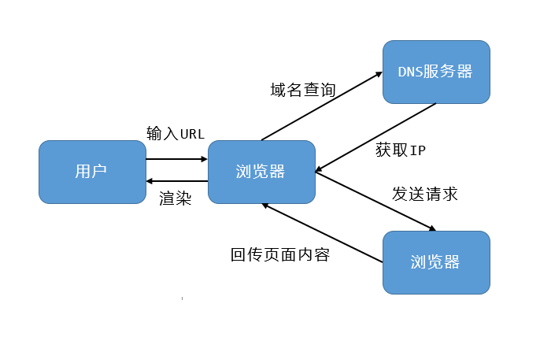
图 1 前端请求

超文本传输协议(HTTP)是一种`通信协议`，它允许将超文本标记语言(HTML)文档从 Web 服务器传送到客户端的浏览器中。

HTTP 是一个属于`应用层的面向对象的协议`，由于其简洁、快速的方式，适用于分布式超媒体信息系统。它于 1990 年提出，经过几年的使用与发展，得到不断的完善和扩展。

Web 是一种基于超文本和 HTTP 的、全球性的、动态交互的、跨平台的分布式`图形信息系统`。

建立在 Internet 上的一种`网络服务`，为浏览者在 Internet 上查找和浏览信息提供了图形化的、易于访问的直观界面，其中的文档及超链接将 Internet 上的信息节点组织成一个互为关联的网状结构。

1990 年 10 月：万维网之父 Tim Berners-Lee 最早提出了 HTTP 协议
1991 年：HTTP/0.9 诞生
1996 年 5 月：HTTP/1.0 发布
1997 年 1 月：HTTP/1.1 发布
2015 年 5 月：HTTP/2.0 提出
HTTP/3.0 QUIC 协议(Quick UDP Internet Connection 由谷歌提出，属于传输层协议，主流使用中有两个：1、TCP-面向连接，即数据传输前需要建立连接 2、UDP-面向无连接，传输不可靠)

## 2 TCP/IP 协议族与 HTTP

HTTP 协议是构建在 TCP/IP 协议之上的，是 TCP/IP 协议的一个子集。

为了更好地理解 HTTP 协议，我们先了解一下 TCP/IP 的相关知识。

### 2.1 TCP/IP 协议族：

TCP/IP 协议其实是一系列与互联网相关联的协议集合起来的总称。
分层管理是 TCP/IP 协议的重要特征。

### 2.2 TCP/IP 协议族分层：

TCP/IP 协议族是由一个四层协议组成的系统，这四层分别为：应用层、传输层、网络层和数据链路层。

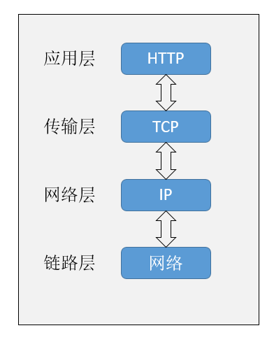

### 2.3 应用层：

应用层一般是我们编写的应用程序，决定了向用户提供的应用服务。应用层可以通过系统调用与传输层进行通信。如 FTP、DNS、HTTP 等。

### 2.4 传输层：

传输层通过系统调用，向应用层提供处于网络连接中的两台计算机之间的数据传输功能。
在传输层有两个性质不同的协议：TCP(面向连接，效率较低)和 UDP(无连接，效率比较高，可靠性低)。

### 2.5 网络层：

网络层用来处理在网络上流动的数据包，数据包是网络传输的最小数据单位。该层规定了通过怎样的路径(传输路线)达到对方计算机，并把数据包传输给对方。

### 2.6 链路层：

链路层用来处理连接网络的硬件部分，包括控制操作系统、硬件设备驱动、NIC(Network Interface Card，网络适配器)以及光纤等物理可见部分。硬件上的范畴均在链路层的作用范围之内。

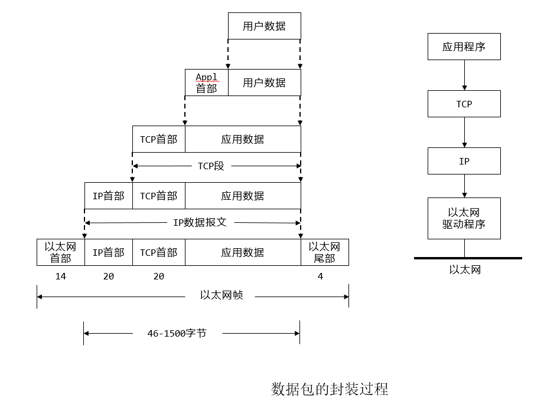

HTTP 数据传输过程
发送端发送数据时，数据会从上层传输到下层，且每经过一层都会被打上该层的头部信息。而接收端接收数据时，数据会从下层传输到上层，传输前会把下层的头部信息删除。

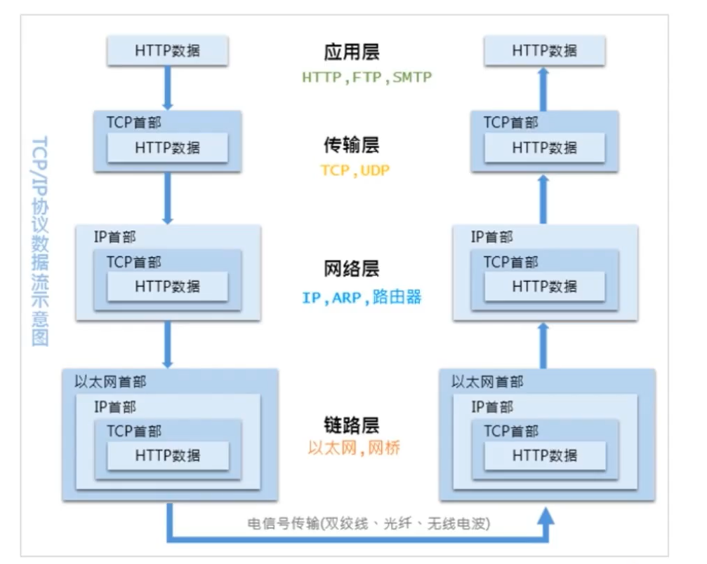

### 2.7 传输层--TCP 三次握手

使用 TCP 协议进行通信的双方必须先建立连接，然后才能开始传输数据。为了确保连接双方可靠性，在双方建立连接时，TCP 协议采用了三次握手策略。

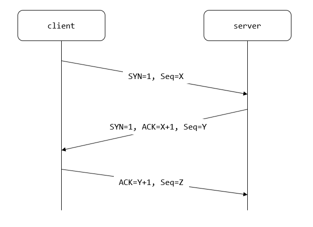

`第一次握手`：客户端发送带有 SYN 标志的连接请求报文段，然后进入 SYN_SEND 状态，等待服务端的确认。
`第二次握手`：服务端接收到客户端的 SYN 报文段后，需要发送 ACK 信息对这个 SYN 报文段进行确认。同时，还要发送自己的 SYN 请求信息。服务端会将上述的信息放到一个报文段(SYN+ACK 报文段)中，一并发送给客户端，此时服务端会进入 SYN_RECV 状态。
`第三次握手`：客户端接收到服务端的 SYN+ACK 报文段后，会向服务端发送 ACK 确认报文段，这个报文段发送完毕后，客户端和服务端都进入 ESTABLISHED 状态，完成 TCP 三次握手。

三次握手要确认双方的发送和接收能力都是正常的。
想要建立一次连接，至少需要三次握手。

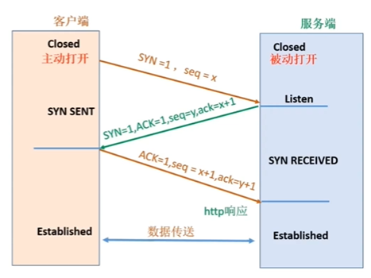

## 3 DNS 域名解析

通常我们访问一个网站，使用的是主机名或者域名来进行访问的。因为相对于 IP 地址(一组纯数字)，域名更容易让人记住。但 TCP/IP 协议的使用的是 IP 地址进行访问的，所以必须有一个机制或服务来把域名转换成 IP 地址。`DNS`服务就是用来解决这个问题的，它提供`域名到IP地址之间的解析服务`。

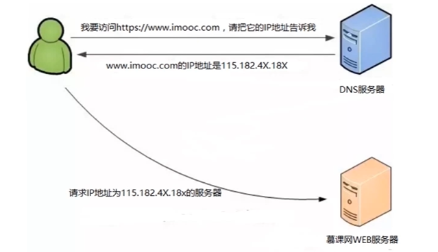

host 文件 => 本地 DNS 服务器 => 首选 DNS 服务器(没有使用转发模式时) => 远端 DNS 服务器(使用转发模式时，逐级向上查找)

CDN 服务器(内容分发)

## 4 HTTP 事务处理过程

HTTP 事务处理过程
当客户端访问 Web 站点时，首先会通过 DNS 服务查询到域名的 IP 地址。然后浏览器生成 HTTP 请求，通过 TCP/IP 协议发送给 Web 服务器。Web 服务器接收到请求后会根据请求生成响应内容，并通过 TCP/IP 协议返回给客户端。

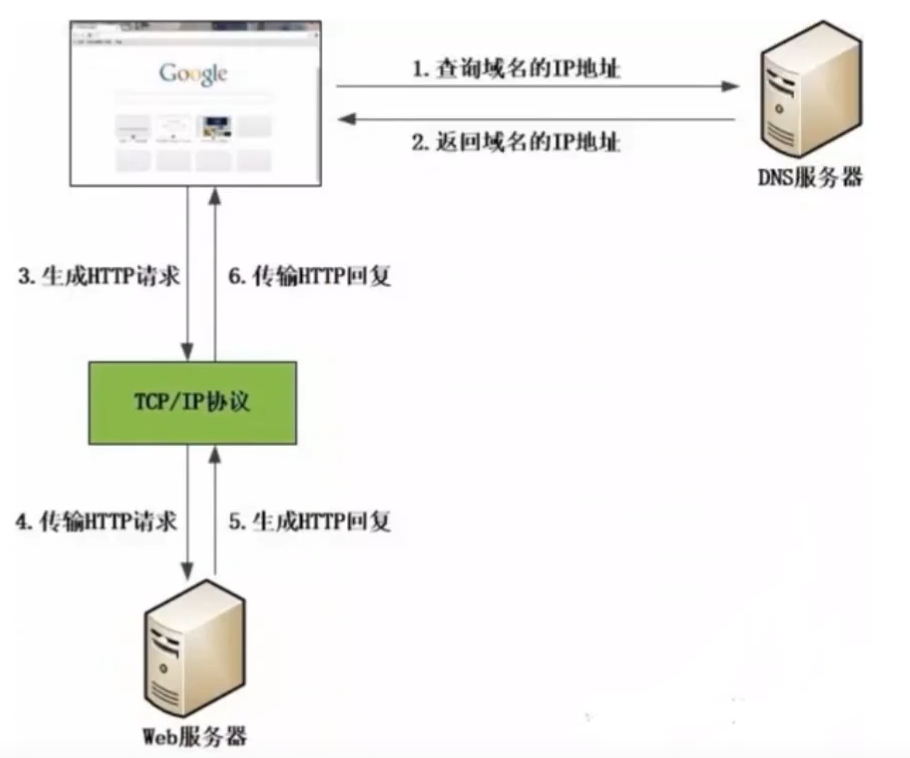

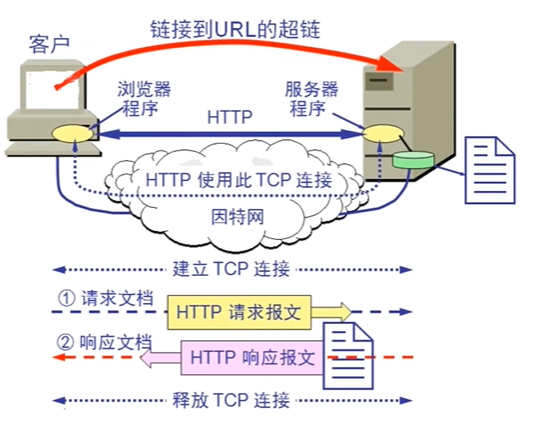

## 5 实验：与 HTTP 请求

wireshark(需要再一次实验)

# 2 熟悉 HTTP 协议结构和通讯原理：

> 熟悉掌握 HTTP 协议报文结构、通讯原理、请求方法、响应状态码

## 2.1 协议特点

1、支持客户/服务器模式：

- 客户/服务器模式工作的方式是由客户端向服务器发出请求，服务器响应请求，并进行相应服务。

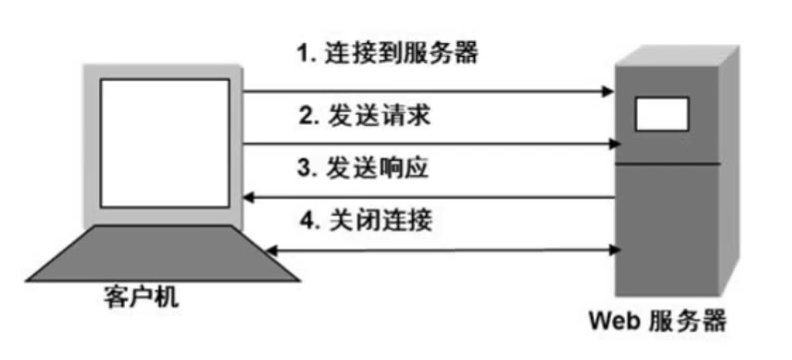

2、简单快速

- 客户想服务器请求服务时，只需传送请求方法和路径。
- 请求方法常用的有 GET、HEAD、POST。每种方法规定了客户与服务器联系的类型不同。
- 由于 HTTP 协议简单，使得 HTTP 服务器的程序规模小，因而通信速度很快。

3、灵活

- HTTP 允许传输任意类型的数据对象。
- 正在传输的类型由 Content-Type(Content-Type 是 HTTP 包中用来表示内容类型的标识)加以标记。

4、无连接

- 无连接的含义是限制每次连接只处理一个请求。-- keep-alive 解决短连接问题
- 服务器处理完客户端的请求后，并收到客户的应答后，即断开连接。
- 采用这种方式可以节省传输时间。

5、无状态

- HTTP 协议是无状态协议。
- 无状态是指协议对于事务处理没有记忆能力。缺少状态意味着如果后续处理需要前面的信息，则它必须重传，这样可能导致每次连接传送的数据量增大。
- 另一方面，在服务器不需要先前信息时，它的应答就较快。

## 2.2 URL、URI 与 URN

Q：我们输入在浏览器里的 Web 地址应该叫 URL 还是 URI？
A：更准确是 URI

- URI：一个紧凑的字符串用来标识抽象或物理资源。
- 一个 URI 可以进一步被分为定位符、名字或两者都是。
- 属于"Uniform Resource Locator"(URL)是 URI 的子集，除了确定一个资源，还提供一种定位该资源的主要访问机制(如其网络"位置")。
- URI 包含 URL 和 URN。

- URI 可以分为 URL、URN 或同时具备 locators 和 names 特性的一个东西。
- URN 的作用就好像一个人的名字，URL 就像一个人的地址。
- 换句话说：URN 确定了东西的身份，URL 提供了找到它的方式。

- URL 是 URI 的一种，但不是所有的 URI 都是 URL。
- URI 和 URL 最大区别是"访问机制"。
- URN 是唯一标识的一部分，是身份信息。

## 2.3 报文结构分析

请求报文：请求方法 请求 URI HTTP 协议及版本
报文头：key-value 形式
报文头与报文体之间有一个空行
报文体：

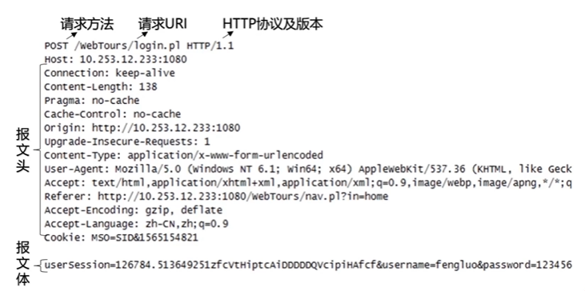

HTTP 报文头：

- HTTP 的报文头大体可以分为四类，分别是：
  通用报文头、请求报文头、响应报文头和实体报文头
- 在 HTTP/1.1 里，一共规范了 47 种报文头字段。

### 1 通用报文头：

既可以用在请求报文，也可以用在响应报文

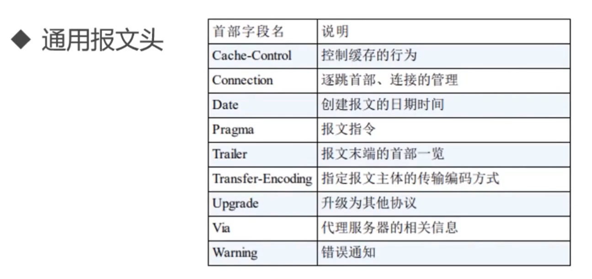

| 首部字段名    | 说明                 |
| ------------- | -------------------- |
| Cache-Control | 控制缓存的行为       |
| Connection    | 逐跳首部、连接的管理 |

### 2 请求报文头

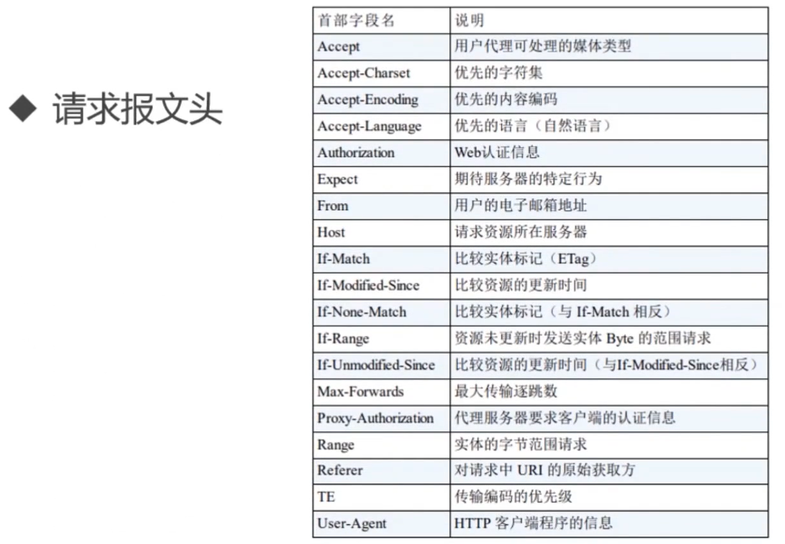

### 3 响应报文头

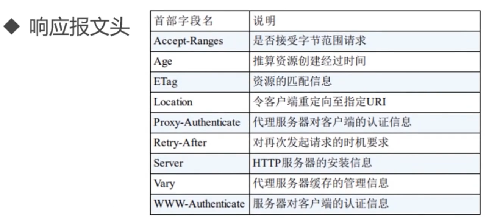

### 4 实体报文头

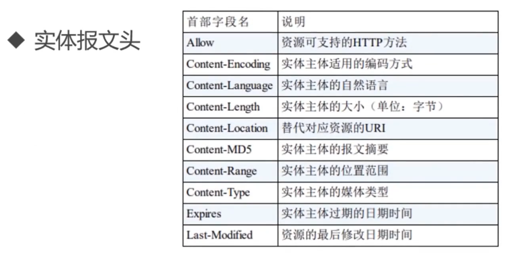

- Accept:
  作用：浏览器端可以接受的媒体类型
  Accept: text/html 代表浏览器可以接受服务器回发的类型为 text/html，也就是我们常说的 html 文档。如果服务器无法返回 text/html 类型的数据，服务器应该返回一个 406 错误(Non Acceptable)
  Accept: \*/\* 代表浏览器可以处理所有类型
  如果想要给显示的媒体类型增加优先级，则使用 q=来额外表示权重值，权重值 q 的范围是 0~1(可精确到小数点后 3 位)，且 1 为最大值。不指定权重值 q 时，默认 q=1.0。当服务器提供多种内容时，将会首先返回权重值最高的媒体类型。

- Accept-Encoding：
  作用：浏览器申明自己接收的编码方法，通常指定压缩方法，是否支持压缩，支持什么压缩方法(gzip，deflate)
  Accept-Encoding: gzip, deflate

- Accept-Language：
  作用：浏览器申明自己接收的语言
  Accept-Language: zh-cn,zh;q=0.7,en-us,en;q=0.3
  客户端在服务器有中文版资源的情况下，会请求其返回中文版对应的响应，没有中文版时，则请求返回英文版响应

- Connection：
  Connection: keep-alive 当一个网页打开完成后，客户端和服务器之间用于传输 HTTP 数据的 TCP 连接不会关闭。如果客户端再次访问这个服务器上的网页，会继续使用这一条已经建立好的连接。
  Connection: close 代表一个 Request 完成后，客户端和服务器之间用于传输 HTTP 数据的 TCP 连接会关闭。当客户端再次发送 Request，需要重新建立 TCP 连接。

- Host
  作用：请求报文头域主要用于指定被请求资源的 Internet 主机和端口号，它通常从 HTTP URL 中提取出来
  我们在浏览器中输入：http://www.fljf.com:8080
  浏览器发送的请求消息中，就会包含 Host 请求报文头域，如下：
  Host: www.fljf.com:8080

- Referer
  当浏览器想 Web 服务器发送请求的时候，一般会带上 Referer，告诉服务器我是从哪个网页链接过来的，服务器借此可以获得一些信息用于处理

- User-Agent
  作用：告诉 HTTP 服务器，客户端使用的操作系统和浏览器的名称和版本
  很多情况下我们会通过 User-Agent 来判断浏览器类型，从而进行不同的兼容设计。

- Content-Type
  作用：说明了报文体内对象的媒体类型
  text/html：HTML 格式
  text/plain：纯本文格式
  text/xml：XML 格式
  image/gif：gif 图片格式
  image/jpeg：jpg 图片格式
  image/png：png 图片格式
  application/xhtml+xml：XHTML 格式
  application/xml：XML 数据格式
  application/atom+xml：Atom XML 聚合格式
  application/json：JSON 数据格式
  application/pdf：pdf 格式
  application/msword：Word 文档格式
  application/octet-stream：二进制流数据(如常见的文件下载)
  application/x-www-form-urlencoded：表单提交

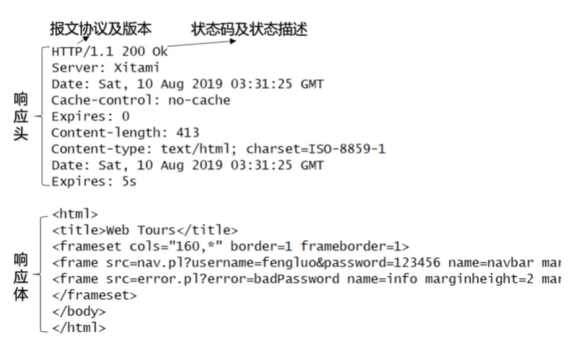

1 响应行：报文协议及版本 状态码及状态描述
2 响应头
3 响应体

## 2.4 请求方法剖析

HTTP/1.1 常用方法：
1 GET
2 POST
3 PUT
4 HEAD
5 DELETE
6 OPTIONS
7 TRACE
8 CONNECT

- GET 获取资源

  - GET 方法用来请求访问已被 URI 识别的资源
  - 指定的资源经服务器端解析后返回响应内容
  - URL 长度限制：IE2803 FireFox65536 Chrome8182 Safari80000 Opera190000
  - GET 方法也可以用来提交表单和其他数据
    http://localhost/login.php?username=aa&password=1234
    从上面的 URL 请求中，很容易辨认出表单提交的内容
    通过 URL 来提交数据，同时，浏览器对于提交 URL 的长度也有所限制

- POST

  - POST 方法与 GET 功能类似，一般用来传输实体的主题
  - POST 方法的主要目的不是获取响应主体的内容，而是用来提交表单数据，克服了 GET 方法的无法保密和数据量限制的问题

- PUT
  从客户端向服务器传送的数据取代指定的文档内容
  PUT 方法与 POST 方法最大的不同是：PUT 是幂等的，而 POST 是不幂等的
  因此，我们更多时候将 PUT 方法用作传输资源
  创建时用 POST，更新时用 PUT(`HTTP/1.1 中 PUT 没有验证机制存在安全性问题`)

- HEAD
  类似于 GET 请求，只不过返回的响应中没有具体的内容，用于获取报文头
  常用于测试超链接的有效性

- DELETE
  请求服务器删除指定的资源(`HTTP/1.1 中 DELETE 没有验证机制存在安全性问题`)

- OPTIONS
  用来查询针对请求 URI 指定的资源支持的方法
  在 Allow 字段中显示服务器支持的方法

- TRACE(不使用)
  回显服务器收到的请求，主要用于测试或诊断(容易出现跨站追踪攻击)

- CONNECT(不使用)
  开启一个客户端与所请求资源之间的双向沟通的通道，它可以用来创建隧道
  HTTP 代理 通过代理服务器时访问 FaceBook 只传输数据包

## 2.5 响应状态码

- 状态码
  是用以表示网页服务器超文本传输协议响应状态的 3 位数字代码。

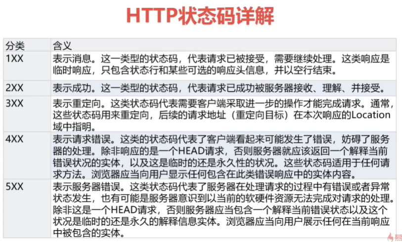

- 常用 HTTP 状态码
  | 状态码 | 状态码英文名称 | 描述 |
  | ------ | --------------------- | --------------------------------------------------------------------------------------------------------------------------------- |
  | 200 | OK | 请求已成功，请求所希望的响应头或数据体将随此响应返回 |
  | 202 | Accepted | 已接受，已经接受请求，但未处理完成 |
  | 206 | Partial Content | 部分内容，服务器成功处理了部分 GET 请求(断点续传) |
  | 301 | Moved Permanently | 永久移动，请求的资源已被永久的移动到新 URI，返回信息会包括新的 URI，浏览器会自动定向到新 URI。今后任何新的请求都使用新的 URI 代替 |
  | 302 | Fond | 临时移动，与 301 类似。但资源只是临时被移动。客户端应继续使用原有 URI |
  | 400 | Bad Request | 客户端请求的语法错误，服务器无法理解 |
  | 401 | Unauthorized | 请求要求用户的身份验证 |
  | 403 | Forbidden | 服务器理解请求客户端的请求，但是拒绝执行此请求 |
  | 404 | Not Found | 服务器无法根据客户端的请求找到资源(网页) |
  | 500 | Internal Server Error | 服务器内部错误，无法完成请求 |
  | 502 | Bad Gateway | 充当网关或代理的服务器，从远端服务器接收到了一个无效的请求 |

实验：使用 telnet 分析 HTTP 协议的通讯过程
打开 CMD
304 与缓存有关，可以直接使用本地缓存即可

## 2.6 HTTP 状态管理(会话机制)：Cookie 与 Session

- Cookie
  - Cookie 实际上是一小段的文本信息。客户端请求服务器，如果服务器需要记录该用户状态，就向客户端浏览器颁发一个 Cookie。
  - 客户端浏览器会把 Cookie 保存起来。当浏览器再请求该网站时，浏览器把请求的网址连同该 Cookie 一并提交给服务器，服务器检查该 Cookie，以此来辨认用户状态。

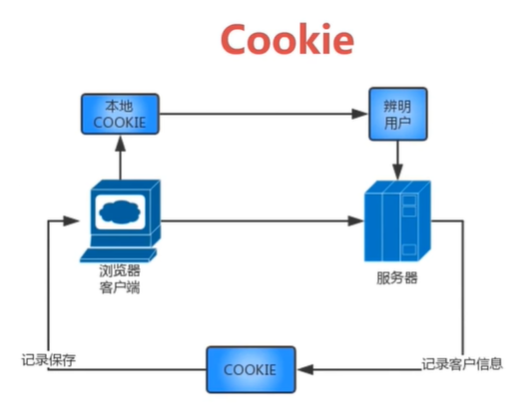

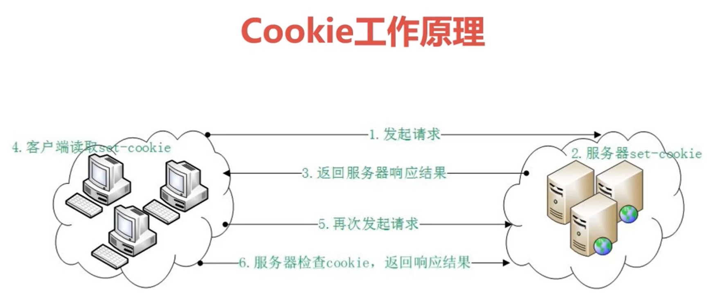

- Session
  - Session 是另一种记录客户状态的机制，保存在服务器上。客户端浏览器访问服务器的时候，服务器把客户端信息以某种形式记录在服务器上。
  - 客户端浏览器再次访问时，只需要从该 Session 中查找该客户的状态即可。

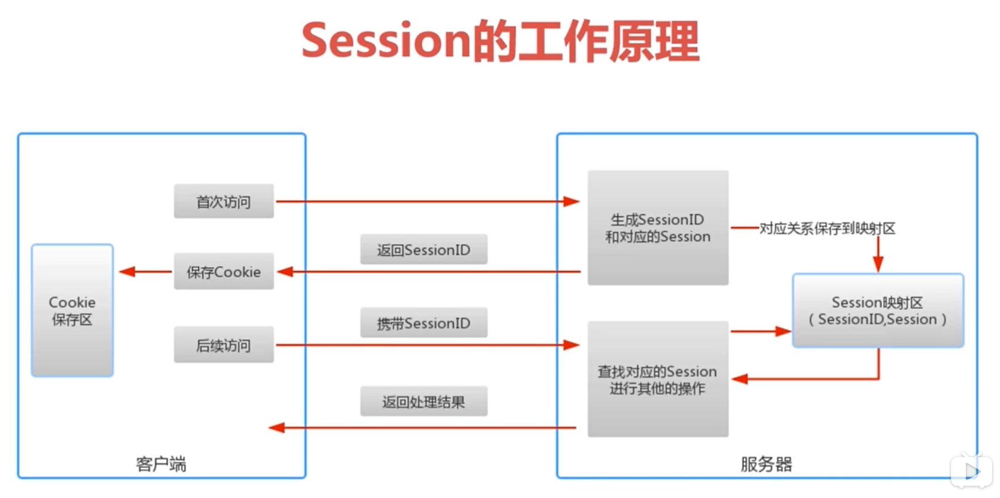

- 保存 Session ID 的方式

  - Cookie
  - URL 重写：(1)直接附加在 URL 上；(2)作为查询字符串，当做参数传递
  - 隐藏表单

- Session 的有效期

  - Session 超时失效
  - 主动失效：程序调用 HttpSession.invalidate()
  - 服务器进程被停止

- Cookie 与 Session：
  1 存放位置不同
  2 安全性(隐私策略)的不同
  3 有效期上的不同
  4 对服务器压力的不同(并发访问的用户很多的时候，会产生很多 Session，耗费服务器大量内存)

敏感信息：账号密码、权限等，尽量不要往 Cookie 写，或者对 Cookie 进行加密

# 3 深入认识 HTTP 协议不为人知的特性和使用方法

> 深入认识 HTTP 协议不为人知的特性和使用方法

## 1 特性

- 字符集与编码

  - 什么是编码？
  - 为什么需要编码？
  - 什么时候会出现乱码？
  - 计算机是如何显示文字的？《计算机图形学》

- 常见编码规范：

  - ASCII 码--1 字节存储空间
  - GBK-- 2 字节存储空间
  - ISO-8859-1：除了 ASCII 外的字符(不支持中文)
  - Unicode：包含了全世界所有字符(4 字节) utf-8(变长字符编码方式) utf-16 utf-32

- 解码过程
- 编码过程：产生计算机可识别的二进制

- URL 的编码与解码
  - URL 是采用 ASCII 字符集进行编码的，所以如果 URL 中含有非 ASCII 字符集中的字符，要对其进行编码。
  - URL 中一些保留字符，如"&"表示参数分隔符，如果想要使用这些保留字，就需要编码。
  - "%编码"规范
  - 对 URL 中属于 ASCII 字符集的非保留字不做编码；对 URL 中的保留字需要取其 ASCII 内码，然后加上"%"前缀对该字符进行编码；对于 URL 中非 ASCII 字符，需要取其 Unicode 内码，然后加上"%"前缀对该字符进行编码。

## 2 基本认证

- 身份认证信息
  1 密码
  2 动态令牌
  3 数字证书
  4 生物认证
  5 IC 卡等

- 常见认证方式
  1 BASIC 认证(基本认证)

  - 什么是 BASIC 认证？
    Base64 方式编码后发送

  2 DIGEST 认证(摘要认证)

  - 什么是 DIGEST 认证？
    为弥补 BASIC 认证存在的弱点，从 HTTP/1.1 起就有了 DIGEST 认证。
    DIGEST 认证同样适用质询/响应的方式，但不会像 BASIC 认证那样直接发送明文密码。

  3 SSL 客户端认证

  - SSL 客户端认证是借由 HTTPS 的客户端证书完成认证的方式。凭借客户端证书认证，服务器可确认访问是否来自已经登录的客户端。
  - 需要一定的成本

  4 FormBase 认证(基于表单认证)

  - 基于表单的认证方法并不是在 HTTP 协议中定义的。
  - 使用由 Web 应用程序各自实现基于表单的认证方式。
  - 通过 Cookie 和 Session 的方式来保持用户的状态。

## 3 长/短连接

- HTTP 协议是基于请求/响应模式的，因此只要给服务端给了响应，本次 HTTP 请求就结束。
- HTTP 的长连接和短连接本质上是`TCP 长连接和短连接`。
- HTTP/1.0 中，默认使用的是短连接。也就是说，浏览器和服务器每进行一次 HTTP，就建立一次连接，结束就中断。
- HTTP/1.1 起，默认使用长连接，用以保持连接特性。
- 短连接：
  建立连接 => 数据传输 => 关闭连接...建立连接 => 数据传输 => 关闭连接
- 长连接：(频繁请求的情况)
  建立连接 => 数据传输 ... (保持连接) ... 数据传输 => 关闭连接

## 4 代理/网关

### 4.1 代理

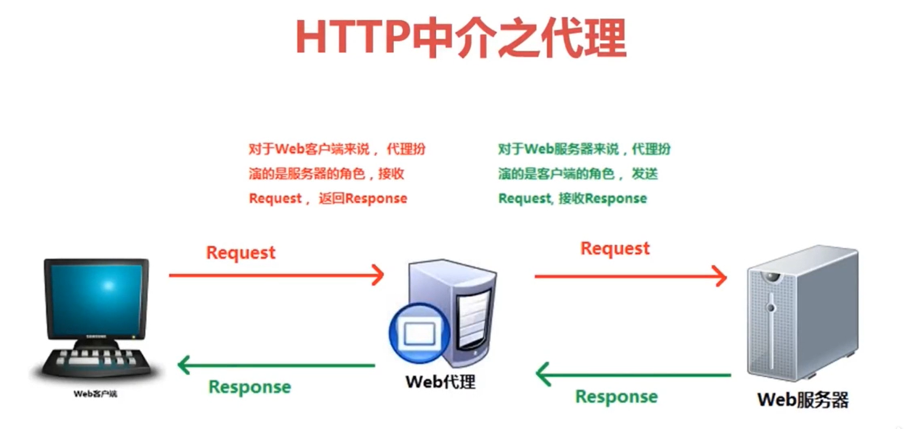

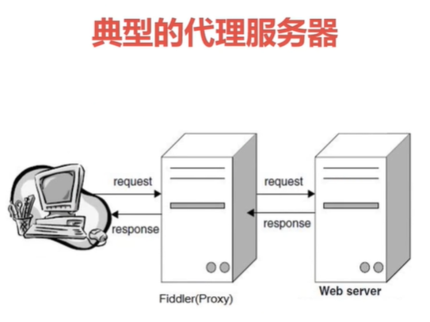

- 代理的作用

  - 抓包
  - FQ
    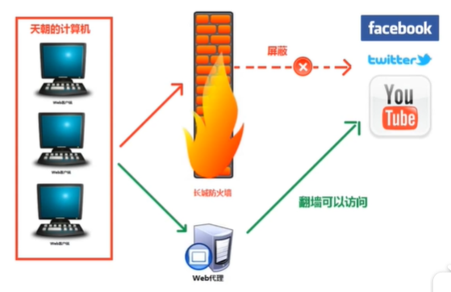
  - 匿名访问
  - 过滤器
    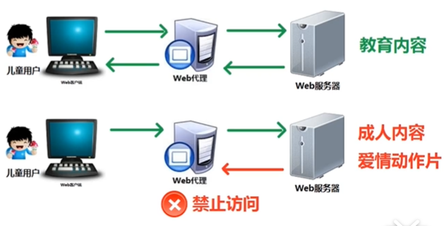

### 4.2 网关

- 网关可以作为某种翻译器使用，它抽象出了一种能够到达资源的方法。网关是资源和应用程序之间的粘合剂。
- 网关扮演的是"协议转换器"的角色

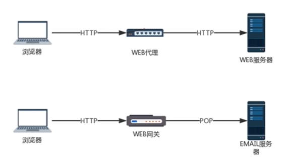

- Web 网关
  Web 网关在一侧使用 HTTP 协议，在另一侧使用另一种协议。
  <客户端协议>/<服务器协议>
  (1) (HTTP/)服务器网关：通过 HTTP 协议与客户端对话，通过其他协议与服务器通信。-- 发邮件
  (2) (/HTTP)客户端网关：通过其他协议与客户端对话，通过 HTTP 协议与服务器通信。

- 常见的网关类型
  1 (HTTP/\*)服务器 Web 网关
  2 (HTTP/HTTPS)服务器端安全网关
  3 (HTTPS/HTTP)客户端安全加速器网关 -- 云端
  4 资源网关

## 5 缓存

为什么要使用 HTTP 缓存？
缓存的内容又是什么？主要针对 CSS 样式缓存

通过请求头和响应头实现

- HTTP 缓存头部字段

  - Cache-Control
    请求/响应头，缓存控制字段
    1 no-store：所有内容都不缓存
    2 no-cache：缓存，但是浏览器使用缓存前，都会请求服务器判断缓存资源是否更新
    3 max-age=x(单位秒) 请求缓存后的 x 秒不再发起请求
    4 s-maxage=x(单位秒) 代理服务器请求源站缓存后的 x 秒不再发起请求，只对 CDN 缓存有效
    5 public 客户端和代理服务器(CDN)都可以缓存
    6 private 只有客户端可以缓存

  - Expires
    响应头，代表资源过期时间，由服务器返回提供，是 HTTP/1.0 的属性，在与 max-age 共存的情况下，优先级要低一些

  - Last-Modified
    响应头，资源最新修改时间，由服务器告诉浏览器

  - if-Modified-Since
    请求头，资源最新修改时间，由浏览器告诉服务器，和 Last-Modified 是一对，它两会进行对比

  - Etag
    响应头，资源标识，由服务器告诉浏览器

  - if-None-Match
    请求头，缓存资源标识，由浏览器告诉服务器(其实就是上次服务器给的 Etag)，和 Etag 是一对，它两会进行对比

- HTTP 缓存工作方式
  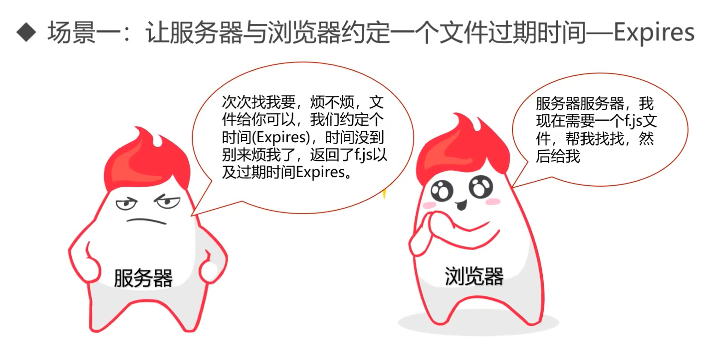

  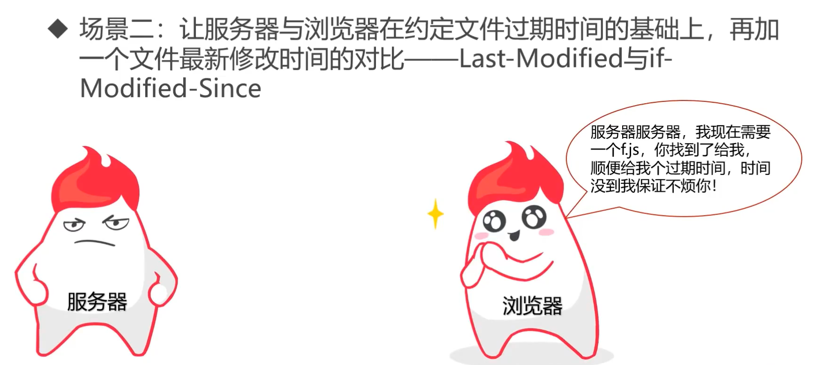

  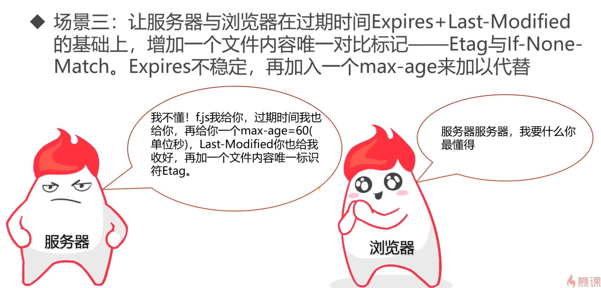

  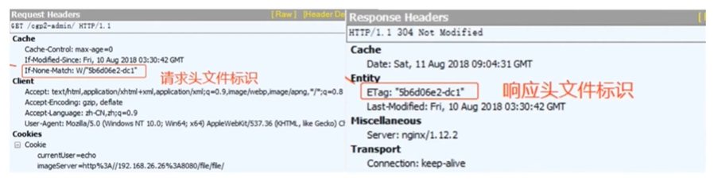

- 缓存改进方案
  (1) md5/hash 缓存
  通过不缓存 html，为静态文件添加 MD5 或者 hash 标识，解决浏览器无法跳过缓存过期时间、感知文件变化的问题。
  (2) CDN 缓存
  CDN 是构建在网络之上的内容分发网络，依靠部署在各地的边缘服务器，通过中心平台的负载均衡、内容分发、调度等功能模块，使用户就近获取所需内容，降低网络拥塞，提高用户访问响应速度和命中率。
  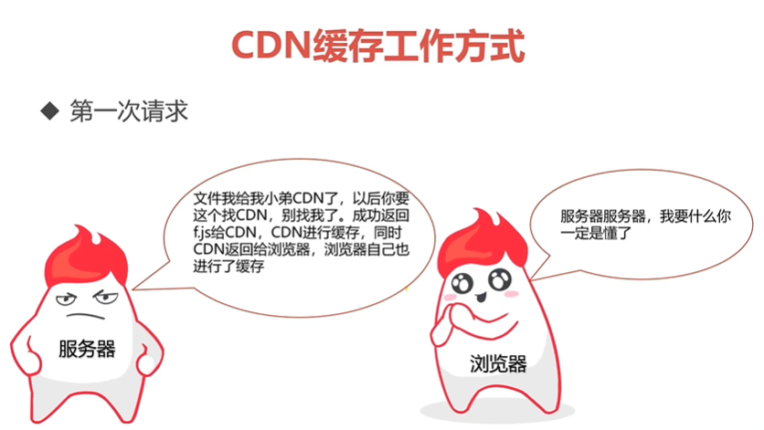

  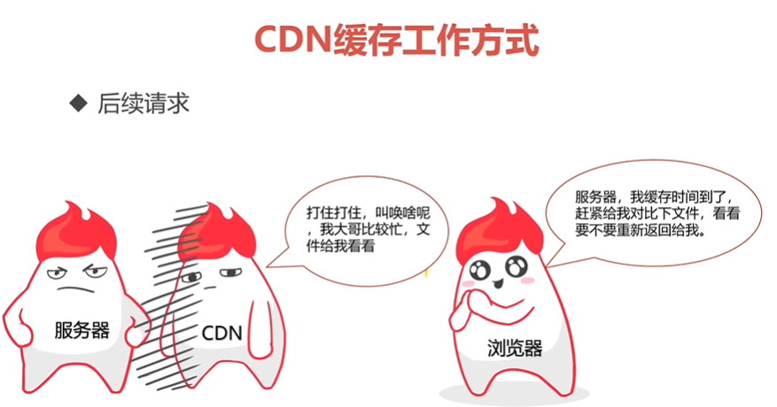

- 浏览器操作对 HTTP 缓存的影响
  |用户操作|Expires/Cache-Control|Last-Modified/Etag|
  |--------|--------------------|------------------|
  |地址栏回车|有效|有效|
  |页面链接跳转|有效|有效|
  |新开窗口|有效|有效|
  |前进、后退|有效|有效|
  |F5 刷新|**无效**|有效|
  |Ctrl+F5 刷新|**无效**|**无效**|

## 6 内容协商机制

指客户端和服务器端就响应的资源内容进行交涉，然后提供给客户端最为适合的资源。内容协商会以响应资源的语言、字符集、编码方式等作为判断的基准。

- 1 客户端驱动
  客户端发起请求，服务器发送可选项列表，客户端做出选择后再发送第二次请求

- 2 服务器驱动(目前使用最为广泛)
  服务器检查客户端的请求头部集并决定提供哪个版本的页面

- 3 透明协商
  某个中间设备(通常是缓存代理)代表客户端进行协商

- 服务器驱动内容协商-请求首部集
  Accept：告知服务器发送何种媒体类型 对应的-- Content-Type
  Accept-Language：告知服务器发送何种语言 对应的-- Content-Language
  Accept-Charset：告知服务器发送何种字符集 对应的-- Content-Type
  Accept-Encoding：告知服务器采用何种编码 对应的-- Content-Encoding

- 服务器驱动内容协商-近似匹配(服务器会设置一个默认值)
  Accept-Language: en;q=0.5, fr;q=0.0, nl;q=1.0, tr;q=0.0

## 7 断点续传和多线程下载

断点续传？多线程下载？
HTTP 是通过在 Header 里两个参数实现的，客户端发送请求时对应的是 `Range`，服务器端响应时对应的是 `Content-Range`

- Range
  用于请求头中，指定第一个字节的位置和最后一个字节的位置，一般格式：
  Range: bytes=(unit=first byte pos)-[last byte pos]
  示例：
  Range: bytes=0-499
  Range: bytes=500-999
  Range: bytes=-500
  Range: bytes=500-
  Range: bytes=500-600,601-999

- Content-Range
  用于响应头中，在发出带 Range 的请求后，服务器会在 Content-Range 头部返回当前接受的范围和文件总大小。一般格式：
  Content-Range: bytes=(unit=first byte pos)-[last byte pos]/[entity length]
  而在响应完成后，返回的响应头内容也不同：
  HTTP/1.1 200 OK(不使用断点续传方式)
  HTTP/1.1 206 Partial Content(使用断点续传方式)

- 断点续传过程

1. 客户端下载一个 1024k 的文件，已经下载了其中 512k。
2. 网络中断，客户端请求续传，因此需要在 HTTP 头中声明本次需要续传的片段：Range: bytes=512000-
   这个头通知服务端从文件的 512k 位置开始传输文件
3. 服务端收到断点续传请求，从文件的 512k 位置开始传输，并且在 HTTP 头中增加：
   Content-Range: bytes=512000-/1024000
   并且此时服务端返回的 HTTP 状态码应该是 206，而不是 200
   多线程是主动的断点续传

# 4 实验使用 HTTP 协议构建应用

> 实验构建 HTTP 请求服务器，还原代码编写，运维搭建过程

## 1 HTTP 请求服务器的实现(开发篇)

jdk tomcat

## 2 HTTP 抓包分析实践

Fiddler

## 3 HTTP 请求客户端实验

Postman YARC

# 5 安全的 HTTPS

> 深入学习 HTTPS 加密传输原理，实验设计 HTTPS 安全服务建设

## 1 从加密技术到 CA 证书

- 中间人攻击

- 加密：
  1 对称加密(秘钥加密，加密和解密使用相同的秘钥)
  AES 加密
  2 非对称加密(公钥加密)

- 证书机构
  服务端网址
  证书颁发机构
  机构私钥加密(服务端公钥)
  机构私钥加密(证书签名)

  HTTPS 可以认为是 `HTTP` + `TLS`
  TLS 是`传输层加密协议`，它的前身是 SSL 协议。

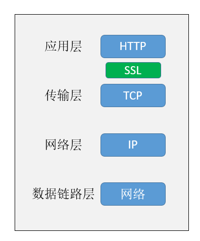

- HTTPS 功能介绍
  内容加密
  身份认证
  数据完整性

- HTTPS 原理介绍

  - 内容加密
    非对称秘钥交换
    对称内容加密
  - 身份认证
    数字证书

## 2 HTTPS 使用成本

- 证书费用以及更新维护
- HTTPS 降低用户访问速度(速度对于用户而言，基本没影响)
- 消耗 CPU 资源，需要增加大量机器(也没有那么大)

## 3 HTTPS 对性能的影响

- 协议交互所增加的网络 RTT(往返时延，round-trip time)
- 计算耗时
  - 浏览器计算耗时
  - 服务端计算耗时

一般优化：TCP Fast Open、HSTS、Session 优先 ECC 加密、硬件加速
对网络知识和加密算法要有扎实的掌握

- HTTPS 常见问题
  - HTTPS 加密是不是需要在我的电脑上安装证书/保存密码？
  - HTTPS 不就是在 HTTP 后面加个 S，很难么？
  - HTTPS 解决了所有劫持问题吗？

## 4 实验：设计属于自己的安全请求服务

CA 证书获取或购买
使用 tomcat 生成服务端证书
制作客户端证书
修改配置以支持 HTTPS

# 6 基于 HTTP 的功能追加协议

> 掌握 WebSocket、WebDAV、HTTP2.0、HTTP3.0 等基于 HTTP 的功能追加协议

## 1 HTTP 协议的瓶颈

- 影响 HTTP 网络请求的因素
  - 带宽
  - 延迟
    1. 浏览器阻塞
       一条连接上只可发送`一个`请求
       请求只能`从客户端开始`。客户端不可以接受除响应以外的指令。
       请求/响应头部不经压缩就发送
       每次互相发送相同的头部造成的浪费较多
       非强制压缩发送
    2. DNS 查询
    3. 建立连接

## 2 双工通信的 WebSocket

WebSocket 与 HTTP 存在交集，仅仅是为了能够兼容 HTTP

- 非持久化的 HTTP

  1. 连接到服务器(客户端=>服务器端)
  2. 发送请求(客户端=>服务器端)
  3. 发送响应(客户端<=服务器端)
  4. 关闭连接(客户端<=>服务器端)

- WebSocket 的"握手"
  - 客户端
    Upgrade: websocket
    Connection: Upgrade
    Sec-WebSocket-Key:
    Sec-WebSocket-Protocol:
    Sec-WebSocket-Version:
  - 服务端
    HTTP/1.1 101 Switching Protocols
    Upgrade: websocket
    Connection: Upgrade
    Sec-WebSocket-Accept:
    Sec-WebSocket-Protocol:

AJAX 轮询(速度)
Long Poll(采用阻塞模型)(容量，需要高并发)

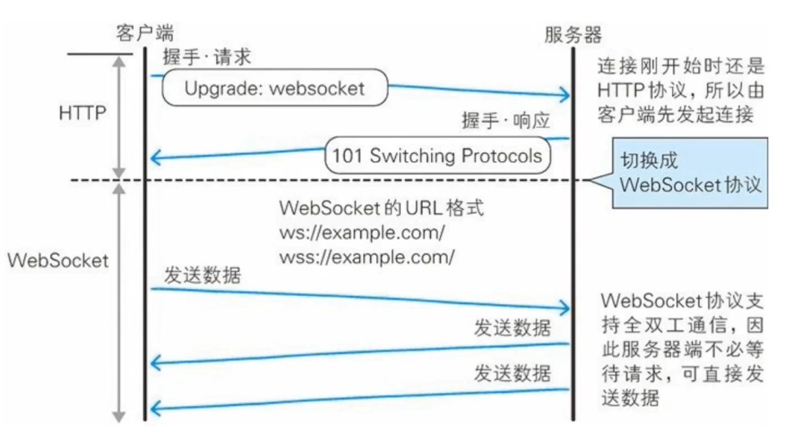

- WebSocket 的特点：
  真正的全双工方式
  减少通信量

## 3 SPDY 与 HTTP2.0

- HTTP 缺陷
  单路连接 请求低效
  HTTP 只允许由客户端主动发起请求
  HTTP 头部冗余

- SPDY
  多路复用 请求优化
  支持服务器推送技术
  SPDY 压缩了 HTTP 头
  强制使用了 SSL 传输协议

- HTTP2.0

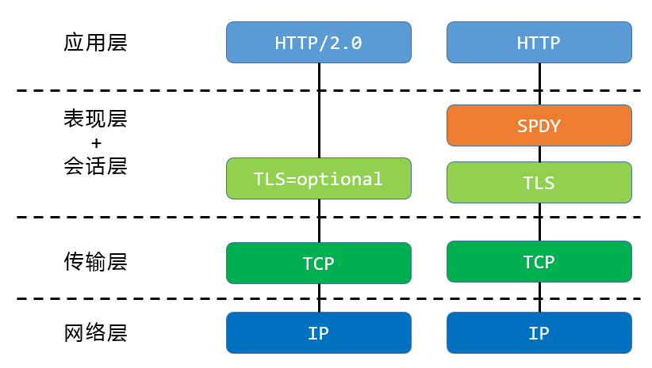

- HTTP/2.0 性能增强的核心：二进制分帧

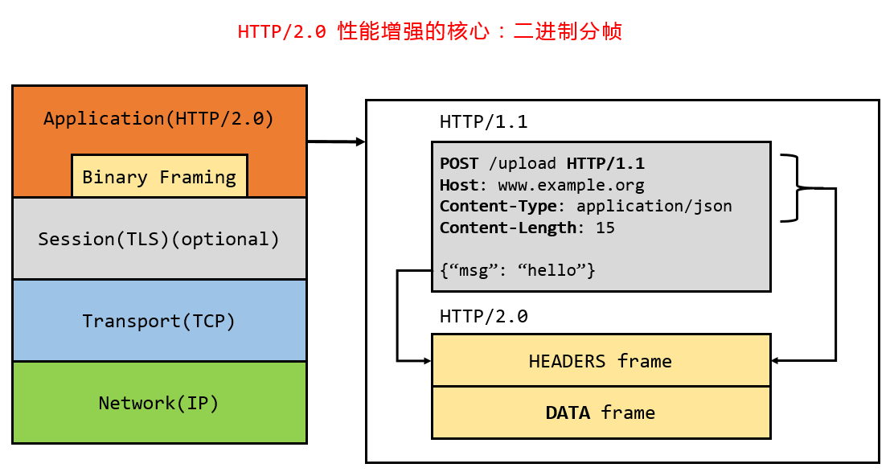

- HTTP/2.0 首部压缩

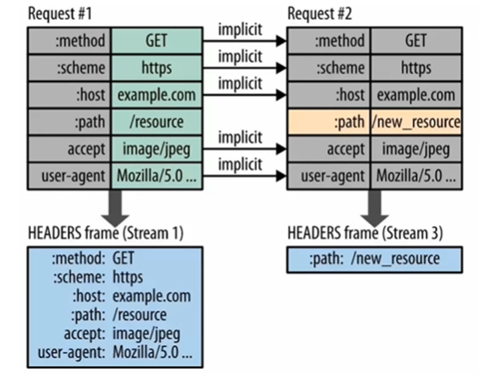

- HTTP/2.0 多路复用
  HTTP/2 Inside: multiplexing
  性能在于低延迟

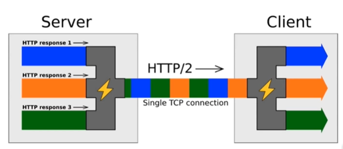

- 单链接多资源的优势
  可以减少`服务链接压力`，内存占用少了，连接吞吐量大了
  由于 TCP 连接减少而使`网络拥塞状况`得以改观
  慢启动时间变少，`拥塞`和`丢包`恢复速度更快

- 并行双向字节流的请求和响应
  并行交错地发送`请求`，请求之间`互不干扰`
  并行交错地发送`响应`，响应之间`互不干扰`
  只使用一个连接即可`并行发送`多个请求和响应
  消除不必要的延迟，减少页面加载时间

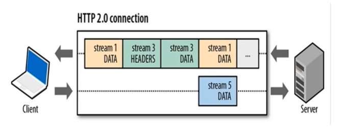

- 请求优先级
  高优先级的流都应该优先发送
  优先级不是绝对的
  不同优先级混合也是必须的

- 服务器推送

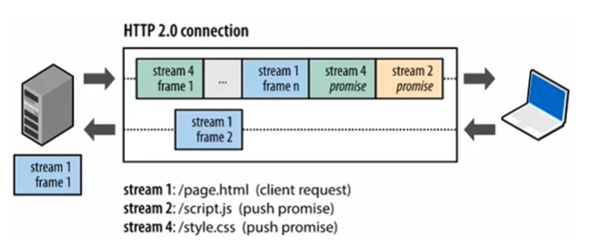

## 4 WebDAV 协议

## 5 QUIC 与 HTTP3.0

## 6 实验：HTTP1.1 升级到 HTTP2.0

# 7 Web 安全威胁解析

> 浅析 Web 安全，通过验证机制、会话管理、SQL 注入、跨站攻击等多方面深入安全世界

## 1 Web 安全攻击概述

- Web 应用的概念
  Web 应用是由动态脚本、编译过的代码等组合而成。
  它通常架设在 Web 服务器上，用户在 Web 浏览器上发送请求。
  这些请求使用 HTTP 协议，由 Web 应用和企业后台的数据及其他动态内容通信。

- Web 应用三层架构

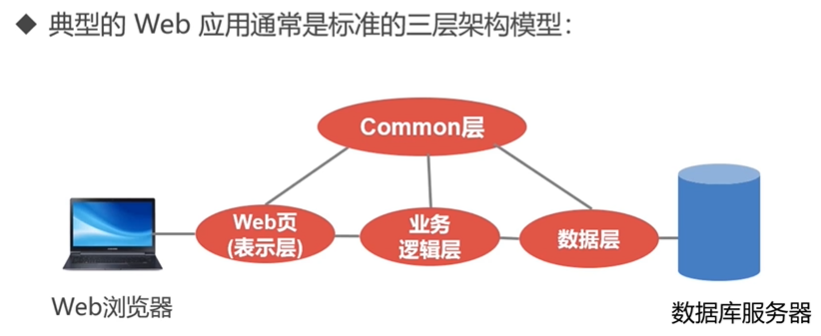

安全问题常常产生于表示层和业务逻辑层

- 日常生活中的"安全"
  为什么我们登录的时候经常要求我们输入一个验证码？防止暴力破解
  在一个网站上长时间没有操作，为什么 Session 会失效？

- 典型安全模型
  为什么北京地铁拥堵现象，容易发生安全问题？
  如果是你，发挥天马行空的想像，有什么办法解决？扩容、限流、提升准入标准

- WASC 的定义
  Web Application Security Consortium
  是一个由安全专家、行业顾问和诸多组织的代表组成的国际团体
  他们负责为 WWW 制定被广为接受的应用安全标准

- WASC 将 Web 应用安全威胁分为六类：

  1. Authentication(验证)：用来确认某用户、服务或是应用身份的攻击手段
  2. Authorization(授权)：用来决定是否某用户、服务或是应用具有执行请求动作必要权限的攻击手段
  3. Client-Side-Attacks(客户侧攻击)：用来扰乱或是探测 Web 站点用户的攻击手段
  4. Command Execution(命令执行)：在 Web 站点上执行远程命令的攻击手段
  5. Information Disclosure(信息暴露)：用来获取 Web 站点具体系统信息的攻击手段
  6. Logical Attacks(逻辑性攻击)：用来扰乱或是探测 Web 应用逻辑流程的攻击手段

- OWASP
  Open Web Application Security Project
  该组织致力于发现和解决不安全 Web 应用的根本原因
  它们最重要的项目之一是"Web 应用的十大安全隐患"
  总结了目前 Web 应用最常受到的十种攻击手段，并且按照攻击发生的概率进行了排序

- 从 OWASP 谈漏洞分类
  A1: 2017-注入：将不受信任的数据作为命令或查询的一部分发送到解析器时，会产生 MySQL 注入、NoSQL 注入、OS 注入和 LDAP 注入缺陷。
  A2: 2017-失效的身份认证：通过错误使用应用程序的身份认证和会话管理功能，攻击者能够破译密码、秘钥或会话令牌。
  A3: 2017-敏感数据泄漏：许多 Web 程序和 API 都无法正确保护敏感数据，攻击可通过窃取或修改未加密的数据来实施信用卡诈骗、身份盗窃等犯罪行为。
  A4: 2017-XLM 外部实体(XXE)：许多较早的或配置错误的 XML 处理器评估的 XML 文件中的外部实体引用。攻击者可利用外部实体窃取内部文件、执行远程代码。
  A5: 2017-失效的访问控制：未对通过身份验证的用户实施恰当的访问控制。
  A6: 2017-安全配置错误：安全配置错误是最常见的安全问题，这通常是由于不安全的默认配置、不完整的临时配置、开源云错误等造成。
  A7: 2017-跨站脚本(XSS)：XSS 让攻击者能够在受害者的浏览器中执行脚本，并劫持用户会话、破坏网站或将用户重定向到恶意站点。
  A8: 2017-不完全的反序列化：不安全的反序列化会导致远程代码执行。
  A9: 2017-使用含有已知漏洞的组件：组件如库、框架和其他软件模块拥有和应用程序相同的权限。
  A10: 2017-不足的日志记录和监控：不足的日志记录和监控，以及事件响应缺失或无效的集成，使攻击者能够进一步攻击系统、保持持续性、篡改、提取或销毁数据。

## 2 验证机制

- 验证机制概述

  1. 验证机制是 Web 应用程序中最简单的一种`安全机制`。
     一般来说，应用程序必须核实用户提交的用户名和密码是否正确。正确则允许登录，否则禁止登录。
  2. 验证机制和应用程序防御恶意攻击的`核心机制`
     它处在`安全防御`的最前沿，如果被用户轻易突破，通常应用程序的全部功能、数据都会被其控制
     `缺乏安全有效的验证机制`，其他核心安全机制都无法实施(会话管理和访问控制)

- 典型的身份验证模式

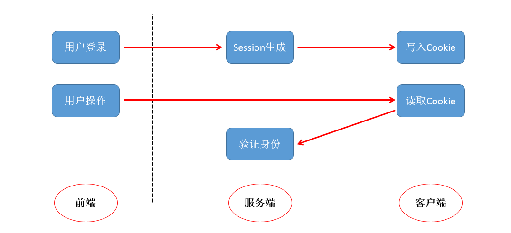

- 验证技术
  基于 HTML 表单的验证
  多元机制，如组合型密码
  客户端 SSL 证书

- 弱密码
  许多 Web 应用程序没有或很少对用户密码强度进行控制

  - 非常短或空白摩玛
  - 以常用字典词汇为密码(password、123456)
  - 密码与用户名完全相同
  - 长时间使用默认密码

- 暴力破解

  - 登录功能的公开性会诱使攻击者视图猜测用户名和密码，从而获得访问应用程序的权力
  - 如果应用程序允许攻击者用不同的密码暴力尝试，直到他找到正确的密码，这个程序就非常容易遭受攻击
  - 执行暴力攻击
    拦截请求 => 发送至攻击模块 => 配置有效载荷 => 配置攻击监控参数 => 执行攻击
  - 很多工具(如 Burpsuite)自身提供了一些常用密码破解 list，我们也可以自行添加一些常用字典，网上也有更多全面的密码字典
  - 依赖今天的带宽和处理能力，根据经验，每分钟可以发出几千甚至上万个登录测试，如果没有一些安全措施的话，最强大的密码也最终会被攻破

- 安全措施

  1. 验证码技术

  - 最常见和有效的应对方式，需要注意几个问题：
    1. `验证码`是否真实有效
    2. 验证码`复杂度`
    3. 应对当前的"`打码`"事业盛行
    4. 人们已经对`captcha技术`做了大量研究

  2. Cookie 和会话检测

  - 有些应用程序会设置一个 Cookie，如 failedlogin=0；尝试登陆失败，递增该值，达到某个上限，检测到这个值并拒绝再次处理登录。
  - 失败计数器可能在 Cookie 中，也可能存储在会话中。

  3. 双因子认证

  - 双因子认证的核心是综合 what you know(个人密码)和 what you have(手机)来达到双重认证效果。
  - 目前很多电商、银行都采用了该认证方式。

- 忘记密码
  核心问题就是忘记密码的流程跳过了身份验证
  三种方式来认证用户：

  1. 用户设定的安全问题
  2. 用户注册时留下的安全邮箱
  3. 给预留手机号发送验证码短信

- 忘记密码存在安全漏洞

## 3 会话管理

- 会话管理概述
  绝大多数 Web 应用程序中，会话管理机制是一个基本的`安全组件`。
  会话管理在应用程序执行登录功能时显得特别重要。
  因为，它可在用户通过请求提交他们的证书后，持续向应用程序保证任何特定用户身份的`真实性`。
  由于会话管理机制所发挥的关键作用，它们称为针对应用程序的恶意攻击的主要目标。
  若攻击者能够破坏应用程序的会话管理，他就能轻易避开其实施的验证机制，不需要用户证书即可伪装成其他应用程序用户。
  如果攻击者以这种方式攻破一个管理用户，那么他就能够控制整个应用程序。

- 会话令牌生成漏洞
  一些`会话令牌`通过用户的用户名或电子邮件地址转换而来，或者使用与其相关的其他信息创建。
  这些信息可以某种方式进行`编码或模糊处理`，也可与其他数据结构结合在一起。

- 令牌可预测
  一些会话令牌并不包含与某个特殊用户有关的任何有意义的数据，但由于它们包含某种顺序或模式，允许攻击者通过几个令牌样本即可推断出应用程序最近发布的其他有效令牌，因此具有`可预测性`。
  即使推断过程需要作出大量尝试，并且成功率极低(例如，每 1000 次尝试得到一个有效令牌)，`自动攻击工具`也仍然能够利用这种缺陷在很短的时间内确定大量有效令牌。

- 隐含序列

- 会话令牌生成漏洞
  生成随机数强度不足
  计算机中的数据极少完全随机
  因此，如果由于某种原因需要随机数据，一般通过`软件`使用各种技巧生成`伪随机数字`
  所使用的一些算法生成看似随机并且在可能的数值范围内平均分布的序列

- 会话终止攻击
  尽可能缩短一个会话的寿命可降低攻击者截获、猜测或滥用有效会话令牌的可能性。
  其次，如果用户不再需要现有会话，终止会话为用户提供一种使其失效的途径，再进一步降低上述可能性的同时，在某种程度上确保共享计算环境中会话的安全。
  一些应用程序并不实施有效的会话终止功能。
  会话一旦建立，它在收到最后请求后的许多天内也仍然有效，直到服务器最终将其清除。
  有些时候，退出功能实际上并不能帮助服务器`终止会话`。
  即使服务器从用户的浏览器中删除令牌(例如，通过发布一个清空令牌的 Set-Cookie 指令)。
  然而，如果用户继续提交这个令牌，服务器仍然接受它。
  最糟糕的情况：当用户单击"退出"按钮时，应用程序并不与服务器通信，因此`服务器不采取任何行动`。
  相反，应用程序执行一段客户端脚本`清空用户的 Cookie`，在随后的请求中将用户返回到登录页面。
  访问这个 Cookie 的攻击者就能使用会话，好像用户从未退出一样。
  攻击者通过`网络嗅探`、`XSS 攻击`等方式获取被攻击者会话令牌的攻击方式。
  这种攻击方式最简单也最有效，也是目前最多采用的攻击方式。

- 会话管理漏洞的防御
  1. 令牌传输安全
  - 令牌只通过 HTTPS 传送。
  - 如果使用 HTTP Cookie 传送令牌(大多数情况下)，应将这些 Cookie 标记为 Secure，以防止用户浏览器通过 HTTP 传送它们。
  2. 增加软硬会话过期
  - 软会话过期，它指的是用户在一定的时间内与应用系统没有交互，则`会话过期`，也就是我们常说的`Session 失效`。
  - `硬会话过期`，它指的是用户登录到系统中经过一定的时间后，不管用户做什么，该会话都会过期。
  3. 提供完善的注销功能
  - 用户可以手动地使当前会话过期，这就是我们在几乎所有网站上都看到的 logout 按钮。
  - TIPS：要保证注销不存在会话终止漏洞。

## 4 SQL 注入

- SQL 注入原理
  几乎每一个 Web 应用都需要使用`数据库`来保存操作所需的各种信息。
  所以 Web 程序经常会建立用户提交数据的 SQL 语句。
  如果，建立这种语句的方法不安全，那么应用程序就很容易受到 SQL 注入的攻击。
  最严重的情况下，攻击者可利用 `SQL 注入`读取甚至修改数据库中保存的所有数据。
  用户可以提交一段`数据库查询代码`，根据程序返回的结果，获取某些他想得知的数据。
  这就是所谓的 `SQL Injection`，即 SQL 注入。

- SQL 注入威胁
  1. SQL 注入危害
  - 探知数据库的具体结构，为进一步攻击做准备
  - 泄漏数据，尤其是机密信息、账户信息等
  - 取得更高权限，来修改表数据甚至是内部结构

CSDN 密码泄漏、如家信息泄漏等事件告诉我们，其实 SQL 攻击离我们并不遥远

- SQL 注入防御
  - 参数化查询
    参数化查询是对 SQL 注入根本性的`防御策略`，也叫作预处理语句，在建立一个包含用户输入的 SQL 语句时分为两步：
    1. 指定查询结构，用户输入预留占位符
    2. 指定占位符的内容

## 5 跨站脚本攻击(XSS 攻击)

- XSS 攻击原理
  跨站脚本攻击(Cross Site Script)，XSS 是一种经常出现在 Web 应用中的计算机安全漏洞。
  它允许恶意 Web 用户将代码植入到提供给其他用户使用的页面中，其他用户在观看页面时，恶意脚本就会执行。
  这类攻击通常通过注入 HTML 或 js 等脚本发动攻击。
  攻击成功后，攻击者可以得到私密网页内容和 Cookie 等。
  最近几年 XSS 攻击已经成为最流行的攻击方式。

- XSS 攻击危害
  `盗取各类用户账号`，如机器登录账号、用户网银账号、各类管理员账号
  `控制数据`，包括读取、篡改、添加、删除企业敏感数据的能力
  盗窃企业重要的具有`商业价值`的资料
  非法转账
  强制网站挂木马
  控制受害者机器向其他网站发起攻击

- XSS 分类
  针对 XSS 的攻击方式不同，可以把 XSS 分为如下三大类：

  1. 反射式 XSS
  2. 存储式 XSS
  3. 基于 DOM 的 XSS

- 反射式 XSS
  也称为`非永久性 XSS`，是目前最流行的 XSS 攻击。
  它出现在服务器直接使用客户端提交的数据，如 URL 的数据、HTML 表单中提交的数据等，并且没有对数据进行无害化处理。
  如果提交的数据中含有 HTML 控制字符而没有被正确处理，那么一个简单的 XSS 攻击就会发生。
  典型的反射式攻击可通过一个邮件或中间网站，诱饵是一个看起来可信任的站点链接，其中包含 XSS 攻击脚本。
  如果信任的网站没有正确处理这个脚本，用户点击后就会导致浏览器执行含有恶意攻击的脚本。

- 存储式 XSS
  也称为`永久性 XSS`，危害更大。
  攻击者将攻击脚本上传到 Web 服务器上，使得所有访问该页面的用户都面临信息泄漏的可能，其中也包括了 Web 服务器的管理员。
  存储式 XSS 多发生在最终显示给其他用户的位置，包括：
  个人信息字段，如姓名、地址、电子邮件、电话等
  文档、上传文件及其他数据的名称
  提交给应用程序管理员的反馈或问题
  向其他应用程序用户传送的消息、注释、问题等
  在用户之间共享的上传文件内容

- 基于 DOM 的 XSS 攻击
  反射式 XSS 攻击和存储式 XSS 攻击都是通过服务器端提取用户提交的数据。
  并且以不安全的方式将其返回给用户。
  基于 DOM 的攻击仅仅通过 JavaScript 的方式执行
  也就是说，这种攻击常发生在应用程序每次返回相同的静态 HTML，而通过客户端 JavaScript 动态生成信息，并不会跟服务端交互的时候获取。

- XSS 攻击载荷

1. 会话令牌
   XSS 攻击最普遍的方式
   截取一名受害者的会话令牌，劫持他的会话，进而作为受害者的身份来使用应用程序，执行任意操作并占有该用户的账户。

2. 虚拟置换
   这种攻击需要在一个 Web 应用程序页面注入恶意数据，从而向应用程序的用户传送误导性信息。

## 6 CSRF 攻击

## 7 防御措施

## 8 安全思想

理论联系实际：
编写 HTTP 服务端代码(C) => HTTP 服务发布部署(DP) => 应用 HTTPS(HTTPS) => 升级 HTTP2.0(SPDY)
